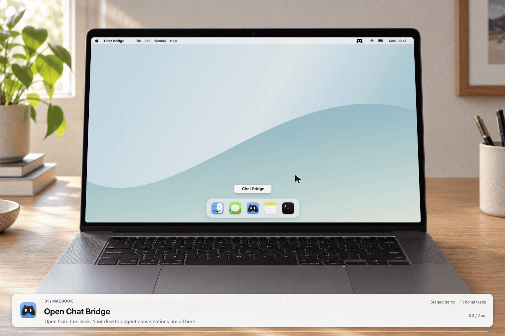

<div align="center">
  
  <h1>Chat Bridge</h1>
  <p>把电脑上的 AI 会话，带进微信和 iMessage。</p>
  <p><a href="README.md">English</a> · <strong>中文</strong> · <a href="README.ja.md">日本語</a> · <a href="README.ko.md">한국어</a> · <a href="README.fr.md">Français</a> · <a href="README.es.md">Español</a></p>


[](https://github.com/section9-lab/chat-bridge/releases)
[](LICENSE)

</div>

## 看它如何工作

<p align="center"></p>
<p align="center"><a href="docs/assets/chat-bridge-demo.mp4">高清 MP4 · 可暂停查看</a> · <a href="docs/assets/chat-bridge-demo-poster.png">静态预览</a></p>
<p align="center"><sub>75 秒场景演示 · 原生 Mac 界面与合成设备场景；任务和回复为演示数据，不连接真实账号。</sub></p>

## 离开电脑，也能接着聊

Chat Bridge 是一款 macOS 菜单栏应用。把微信或 iMessage 连接到 Mac 上的 AI Agent，就能从手机发起任务、继续已有会话，让结果回到原来的聊天里。

- **接着聊**：继续电脑上的已有会话，保留项目和上下文。
- **直接说意图**：新建会话、选择项目、切换 Agent，用一句话完成。
- **拿到结果**：接收回复，以及任务产出的图片、视频和文档。
- **随手打开**：菜单栏只留一个 Logo，点击恢复上次会话和草稿。

## 你可以这样说

> 用 Codex 继续「旅行清单」项目，帮我整理周末计划。

> 用 Claude 新建一个无项目会话，给我三个早餐点子。

> 列出 Claude 在「商城」项目里的会话。

开启智能路由后，Chat Bridge 会理解你的目标。判断不清时，它会保留原消息，给出可回复的文本选项；回复编号或选项文字就能继续，不必记住命令。

每次接收任务，都会告诉你消息发到了哪里：

```text
Codex > 旅行清单 > 周末计划
已收到✅
```

## 三步开始

在 [Releases](https://github.com/section9-lab/chat-bridge/releases) 选择 DMG：Apple Silicon 使用 **arm64**，Intel 使用 **x86_64**。打开后将 **Chat Bridge** 拖入 **Applications**。如果尚无可用版本，可按下方说明从源码构建。

DMG 使用 ad-hoc 签名，未经 Apple 公证。首次打开若被阻止，请先确认下载来源，再在「系统设置 → 隐私与安全性」中对该应用选择「仍要打开」。更新后可能需要重新授予完全磁盘访问权限。

<details>
<summary>从源码运行</summary>

需要 Xcode Command Line Tools、Python 3 和网络连接。在仓库根目录执行：

```sh
bash scripts/build-app.sh
open "dist/Chat Bridge.app"
```

默认使用 Apple Development 证书签名。没有证书时，在构建命令前加 `CHAT_BRIDGE_SIGNING_IDENTITY=-`；这种本地签名更新后可能需要重新授予完全磁盘访问权限。

</details>

1. **连接 Agent** — 在 Mac 上安装并登录常用 Agent，在 Chat Bridge 里检查连接状态。
2. **配对消息通道** — 打开「设置 → 消息通道」，用微信扫码，或完成 iMessage 配对。
3. **发出第一条消息** — 在「智能路由」中配置服务并启用自动选择，然后从手机说出你想做的事；也可直接在菜单栏浮窗中聊天。

不启用智能路由时，可以在应用里选择目标，或通过文本菜单与手动命令切换。

## 与你常用的 Agent 一起工作

**Codex · Claude Code · Cursor · Grok · OpenCode · Hermes Agent**

沿用各 Agent 的本机登录和模型配置。可以新建项目内会话、直接开启无项目会话，也能恢复已有会话。实际可用性取决于安装、登录、模型服务和各运行时能力；Claude Chat 与 Cowork 暂未接入。

## 使用前了解

- 需要 **macOS 14+**，并保持 Mac 开机、联网和 Chat Bridge 运行。iMessage 还需要 Messages 登录及完全磁盘访问权限；旧系统数据库兼容性仍需验证。
- 桌面输入框输入 **@文件名** 即可搜索并从候选列表添加文件，左侧回形针也可进入搜索（每条最多 10 个，每个不超过 50 MiB），回复会引用原始消息。微信和 iMessage 仍仅支持**文字输入**，收到的语音、图片和附件不会作为任务执行；符合要求的成果文件可发送回原通道。
- 连接后，消息可以触发文件修改、命令和网络访问。Bridge 创建或恢复的 Codex／Claude Code 会话默认允许完整执行权限，请只绑定自己的可信账号。
- 会话状态保存在 Mac 本地；消息仍经所选通道与 Agent 服务处理。开启智能路由后，消息和相关目标信息会交给你配置的路由服务判断。
- 遇到发送结果不确定的情况，不会自动重复执行或重发。应用界面目前以中文为主。

## 更多

[反馈问题](https://github.com/section9-lab/chat-bridge/issues) · [MIT 许可证](LICENSE)
