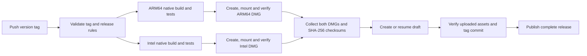

# macOS releases

Pushing a version tag runs [Release macOS](../.github/workflows/release.yml). It builds two native DMGs, tests the packaged app on each architecture, and publishes one GitHub Release after both builds succeed. This first distribution pipeline uses **ad-hoc signing without Apple notarization**, as requested. No Apple credentials or personal access token are required.

## Release flow



| Target | GitHub runner | DMG suffix | Bundled Node architecture |
| --- | --- | --- | --- |
| Apple Silicon | `macos-15` | `macos-arm64.dmg` | `arm64` |
| Intel | `macos-15-intel` | `macos-x86_64.dmg` | `x64` |

Both runners use Xcode 16.4 and target macOS 13.5. The runner architecture is checked before building. Each job compiles Swift and installs native npm dependencies on its own host, avoiding cross-architecture SQLite binaries. Node is pinned by `.nvmrc` and downloaded from Node.js with its official SHA-256 manifest. npm and Swift use the committed lockfiles. Build caches are intentionally omitted for the first pipeline.

The native app icon is compiled separately with Xcode 26+ using `bash scripts/build-icon.sh`. Commit the `AppIcon.icon` source together with `Assets.car` and `AppIcon.icns`. Both release jobs copy these architecture-independent resources; the asset catalog includes static fallbacks for older macOS versions. Icon generation does not raise the app's minimum macOS version or require a newer compiler on the release runners.

## Tags and versions

| Tag | GitHub Release | Example download |
| --- | --- | --- |
| `v1.2.3` | Stable | `ChatBridge-1.2.3-macos-arm64.dmg` |
| `v1.2.3-rc.1` | Prerelease | `ChatBridge-1.2.3-rc.1-macos-arm64.dmg` |
| `v1.2.3-beta.2` | Prerelease | `ChatBridge-1.2.3-beta.2-macos-x86_64.dmg` |

Only `vMAJOR.MINOR.PATCH` with an optional SemVer prerelease suffix is accepted. Leading zeros in numeric identifiers, incomplete versions, and `+build` metadata are rejected. Other pushes do not trigger this workflow. Prereleases never become Latest; stable releases use GitHub's automatic date/version selection.

The tag is the source of truth for the distributable:

- `CFBundleShortVersionString`: numeric version, such as `1.2.3`.
- `CFBundleVersion`: GitHub Actions run number; rerunning the same run keeps that build number.
- `ChatBridgeReleaseVersion`: full version, such as `1.2.3-rc.1`, displayed by the app.
- Bundled service `package.json` and root `package-lock.json` entries: full version, also reported by the running service and Agent clients.

Version stamping happens only inside the built app, before signing. The workflow never commits version bumps back to the repository.

## Assets and installation

A successful release contains exactly these generated assets:

```text
ChatBridge-1.2.3-macos-arm64.dmg
ChatBridge-1.2.3-macos-x86_64.dmg
SHA256SUMS.txt
```

GitHub also supplies its standard source archives. Each DMG contains `Chat Bridge.app` and an `Applications` shortcut for drag-and-drop installation. The app includes Node, the production service dependencies, icons and licenses. Users install and sign in to their preferred Agent separately; they do not need Node, npm or Xcode to run the DMG build.

The generated English release notes explain architecture selection, installation, signing and required permissions. These builds are **ad-hoc signed, not Developer ID signed, and not notarized**. After a blocked first launch, users who trust the download can use System Settings → Privacy & Security → Open Anyway for this app. Managed Macs may not permit this exception. The workflow does not disable Gatekeeper or change system security settings. Full Disk Access may need to be granted again after an ad-hoc update; iMessage, WeChat and Agent setup remain explicit user steps.

To check downloaded files, place both DMGs and the checksum file in one directory and run:

```sh
shasum -a 256 -c SHA256SUMS.txt
```

## Verification and failure handling

Each native build runs the TypeScript service tests and Swift tests. Before packaging, it checks app/service versions, required resources, the pinned Node version, and every Mach-O file's architecture, code signature, linked libraries and minimum macOS version. Dependencies on Homebrew or developer-specific absolute paths are rejected.

The DMG is created with macOS `hdiutil`, verified, mounted read-only, and copied into a temporary installation directory. The copied app is checked again, then its own Node runs the bundled-service smoke checks with a restricted `PATH` and isolated data directory. Those checks exercise native SQLite, RPC, version reporting, preferences and safe unpaired behavior. They do not log into messaging accounts, launch real Agent tasks or validate phone delivery.

| Failure | Result and recovery |
| --- | --- |
| Invalid tag | Fails before allocating macOS build jobs. Push a correctly named tag. |
| Test, native dependency, architecture, signature or DMG failure | No Release is created. The other architecture may finish for diagnosis. Fix the cause and rerun the failed job if no source change is needed. |
| One DMG is absent, empty or from a different version | Publishing stops before any GitHub Release mutation. |
| Upload interruption | The Release remains a draft. Rerunning the failed publish job resumes the workflow's draft and replaces its expected assets. |
| Uploaded asset size or SHA-256 differs | Publishing stops and leaves the draft for inspection. |
| Tag points to a different commit | Publishing stops; the tag is checked before creating a draft and again after uploading. |
| A manually created draft or unexpected asset exists | The workflow refuses to overwrite it. Inspect the draft first. |
| Release is already public | The workflow refuses to replace its assets. Ship changes under a new version tag. |

Draft ownership is recorded with the source commit in an HTML comment in the release notes. Removing that marker makes the draft ineligible for automatic resume. Builds of the same tag are serialized, and a new run does not cancel a running publication. Failed-job reruns can reuse artifacts for seven days; after that, rerun all jobs. A published release is never silently rebuilt in place.

The publish job alone receives `contents: write`; build jobs use read-only permissions. Official checkout/upload/download actions are pinned to full commit SHAs, checkout does not retain Git credentials, and artifact digest mismatch is fatal. Tag values enter shell steps through environment variables rather than shell interpolation. Repository administrators should restrict who can create, move or delete release tags; enabling immutable releases is compatible with the draft-first upload sequence.

## First release

1. Commit the workflow, scripts, app and service source, `.nvmrc`, `bridge/package-lock.json`, `apps/macos/Package.resolved`, app icons and license resources together. A tag can only build files present in its commit.
2. Push that commit. Confirm GitHub Actions is enabled and the repository allows these official actions and the workflow's requested token permissions.
3. Start with a prerelease tag; for example, after choosing the intended commit:

   ```sh
   git tag -a v0.3.1-rc.1 -m "Chat Bridge v0.3.1-rc.1"
   git push origin v0.3.1-rc.1
   ```

4. Check both macOS jobs and the Release assets. Verify installation, first launch, required permissions and messaging on clean Apple Silicon and Intel Macs before declaring broad device compatibility.

Create tags from your own Git client or another appropriately authorized actor. A tag pushed by another workflow using its default `GITHUB_TOKEN` does not trigger a new workflow run under GitHub's event-recursion rules. Push one release tag at a time. Do not move a published tag to fix a release.

## Local dry run

Run from the repository root on the architecture being tested. This writes to a separate output directory and does not change an existing `dist/Chat Bridge.app` or publish anything:

```sh
python3 -B -m unittest discover -s scripts/tests -p 'test_release.py' -v
actionlint .github/workflows/release.yml
shellcheck scripts/build-app.sh scripts/package-dmg.sh

CHAT_BRIDGE_SIGNING_IDENTITY=- \
CHAT_BRIDGE_RELEASE_TAG=v0.3.1-rc.1 \
CHAT_BRIDGE_BUILD_NUMBER=1 \
CHAT_BRIDGE_OUTPUT_DIR="$PWD/dist/release-validation" \
bash scripts/build-app.sh

bash scripts/package-dmg.sh \
  'dist/release-validation/Chat Bridge.app' \
  v0.3.1-rc.1 "$(uname -m)" dist/release-validation/assets
```

An ARM64 local dry run does not validate the Intel runner or the live GitHub upload flow. Those gates must complete in the first tag-triggered workflow. Developer ID signing and notarization are a later change: introduce certificate storage, hardened-runtime entitlements for the app and Node, nested signing, `notarytool`, stapling, and Gatekeeper checks together. This pipeline deliberately has no incomplete certificate-based branch.

### Local verification — 2026-09-21

The dry run above succeeded on an ARM64 Mac using Xcode 26.0 / Swift 6.2. The CI jobs pin Xcode 16.4, so this local run does not establish the hosted toolchain result.

| Check | Result |
| --- | --- |
| Release rules with an offline GitHub API stand-in | 16 passed, including incomplete builds, moved tags, corrupt uploads and draft recovery |
| Service tests | 370 passed |
| Native Swift tests | 48 passed, including the new version display cases |
| DMG mount, copy and bundled-service smoke | 9 passed |
| Wrong architecture and wrong tag supplied to the bundle verifier | Both rejected |
| Actionlint, ShellCheck, shell syntax, README links and whitespace | Passed |

The local `ChatBridge-0.3.1-rc.1-macos-arm64.dmg` is approximately 56.7 MiB. Its SHA-256 is `c324a9451757863d3b466f61730bcce9e06df738be5d90d6d296545844be6e5a`. It is a dry-run artifact, not a published release. This local check preceded the commits, tags and hosted verification below.

### Hosted release verification — 2026-09-21

The prerelease and stable release were built from the same commit, `648edbda846ea4b2c83e3a95558ea1c545470b2a`, on native ARM64 and Intel runners.

| Version | Workflow | Release status |
| --- | --- | --- |
| [v0.3.1-rc.3](https://github.com/section9-lab/chat-bridge/releases/tag/v0.3.1-rc.3) | [35534336591](https://github.com/section9-lab/chat-bridge/actions/runs/35534336591) — passed | Prerelease; not Latest |
| [v0.3.1](https://github.com/section9-lab/chat-bridge/releases/tag/v0.3.1) | [35535280007](https://github.com/section9-lab/chat-bridge/actions/runs/35535280007) — passed | Stable; Latest |

Each workflow passed 17 release-rule tests and, on each architecture, 370 service tests, 48 native tests and 9 installed-bundle checks. All four published DMGs were downloaded again and checked against `SHA256SUMS.txt` and GitHub's asset digests. Read-only mounts confirmed the app and helper versions, all three native binary architectures, the Applications shortcut and ad-hoc signatures. The prerelease contains version `0.3.1-rc.3` with build number `3`; the stable release contains version `0.3.1` with build number `4`.

The first two attempts exposed hosted-runner UI test assumptions and delayed visibility of new drafts in the releases list. Window tests now await native notifications, the CI fixture enables native transparency, and publishing uses the draft creation response directly. The failed tags and workflow logs remain available; the empty draft from the failed publish attempt was removed. No messaging account or real Agent task was exercised by these checks.

## References

- [GitHub-hosted runner architectures](https://docs.github.com/en/actions/reference/runners/github-hosted-runners)
- [Intel macOS 15 image](https://github.com/actions/runner-images/blob/main/images/macos/macos-15-Readme.md) and [ARM64 macOS 15 image](https://github.com/actions/runner-images/blob/main/images/macos/macos-15-arm64-Readme.md)
- [GitHub immutable releases](https://docs.github.com/en/code-security/concepts/supply-chain-security/immutable-releases)
- [GitHub release creation and asset digests](https://docs.github.com/en/rest/releases/releases)
- [Triggering workflows and GITHUB_TOKEN](https://docs.github.com/en/actions/reference/workflows-and-actions/events-that-trigger-workflows)
- [Apple: safely open apps on your Mac](https://support.apple.com/en-us/102445)
- [Apple notarization requirements](https://developer.apple.com/documentation/security/notarizing-macos-software-before-distribution)
