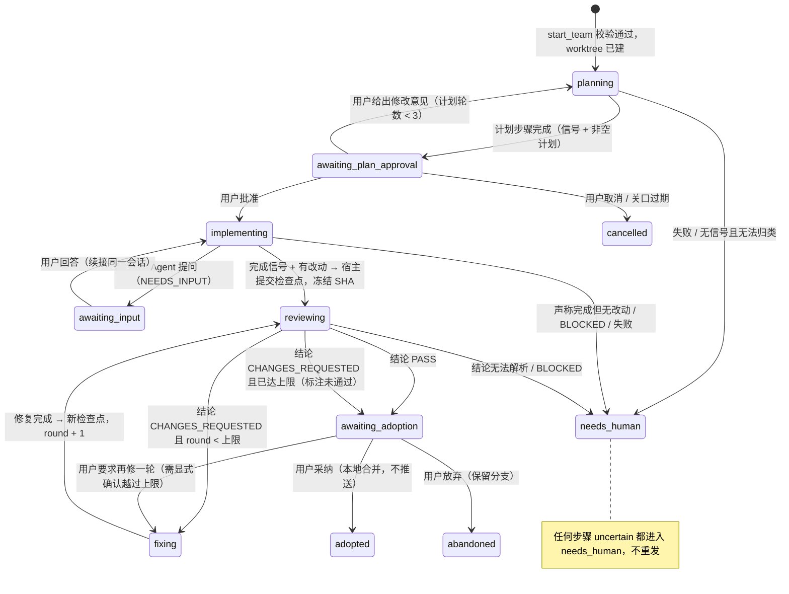

# 多 Agent 编排：流程推进该由模型决定，还是由宿主控制

日期：2026-09-24。本文回答一个问题：多 Agent 协作时，"下一步交给谁、什么时候进入下一步"应该让大模型决定，还是由宿主程序（服务端或本地状态机）控制。文中给出证据，并对 Chat Bridge 的多 Agent 编排提出建议。

同目录的 [paseo.md](paseo.md)、[orca.md](orca.md)、[multica.md](multica.md)、[cindy.md](cindy.md) 是竞品的代码级调研，本文直接引用，不再重复。

**标注约定**
- 【代码】：读源码核实。路径相对各自仓库根目录；Chat Bridge 的路径相对本仓库根目录。
- 【官方】：官方文档、官方博客，或维护者写的 PR 正文、代码注释。
- 【论文】：读过论文正文。【摘要】：只读了摘要。
- 【二手】：第三方文章、社区评论或用户报告。
- 原文引用只保留一处，其余都是中文转述，并给出位置。

---

## 1. 结论

不是二选一。**状态、合法转移、终止条件、轮数和预算上限、"结果不明不重发"、人工关口，这些必须由宿主状态机保证。** 模型只做两类事：在宿主列出的合法选项里做选择（下一个 Agent 是谁、审查结论属于哪一类），以及产出内容（计划、代码、交接摘要、审查意见）。

主要证据：
- **Orca 与 Multica 并不矛盾。** Orca 退役的是"看不懂任务内容却替 Agent 定策略"的调度器，同时把生命周期收紧成显式转移表。Multica 把 Agent 自己发的阶段通知收回服务端之后，仍然因为"让模型决定是否推进"出了越权激活和提前收尾的问题。
- **失败统计。** 在 MAST v3 的失败标签里，与流程控制直接相关的模式占 35.8%–45.4%。这些模式包括越权、重复步骤、不知道何时停、提前终止、偏题。
- **生产系统的走向。** kandev 要求显式完成信号，Cognition 做了 Agentic MapReduce，CrewAI 推荐 Flows，OpenAI Agents SDK 文档也这么写。它们都在往"代码定流程、模型填内容"靠拢。

对 Chat Bridge 的建议：一句话启动跨厂商团队的编排引擎，应当做成**宿主状态机加内置模板**。以"计划 → 人工批准 → 实现 → 审查 → 有界修复 → 人工采纳"为例：
- Jev 继续只做选择题。
- 每一步是否完成，看"显式完成信号 + 外部证据"两者，不采信 Agent 的自述。
- 结果不明的步骤永远不自动重发。

---

## 2. 控制权光谱

### 2.1 光谱总表

| 档位 | 谁决定下一步 | 代表产品 / 框架 | 失败时的典型处理 |
|---|---|---|---|
| **A. 人决定** | 人看完结果，自己点下一步 | Conductor（转发失败检查、审查、交接计划都是按钮）；Vibe Kanban（人工"审查—修复"循环）；Orca 并行赛跑（人挑赢家）；Traycer 手动 Phases；kandev 的 Feature Dev、Plan & Build 模板（回合结束后停在"等用户"） | 人自己处理。宿主只负责隔离、自动提交这类机械步骤 |
| **B. 宿主状态机** | 代码里写好的顺序、图或事件规则 | kandev Kanban 模板（回合结束且收到显式完成信号才推进）；Paseo Hub workflow；Traycer "YOLO for Phases"；Google ADK 的 Sequential / Parallel / Loop；LangGraph 静态边；Microsoft Agent Framework Workflows；CrewAI Flows；Cognition Agentic MapReduce；Agentless | 失败即停或按错误类别重试；硬上限；暂停等人 |
| **C. 模型在合法选项里选** | 代码给出候选集合，模型选一个，代码校验后执行 | **Chat Bridge 现有 Jev 路由**；Paseo Hub 分类 step（只能输出有限枚举）；OpenAI handoffs（用 `is_enabled` 过滤可选目标）；ADK `transfer_to_agent`；Magentic-One 进度台账里的 next_speaker；Multica（服务端检测阶段屏障，leader 决定是否推进）；Claude Code Agent Teams（宿主管任务表和依赖，模型领任务）；CrewAI hierarchical（代码按顺序取任务，模型决定派给谁） | 选项不合法直接拒绝；停滞计数、重新规划；去重 |
| **D. 模型主导** | 主管模型通过工具自由派工，宿主只管生命周期和上限 | Orca 编排（LLM 主管调用 CLI）；Paseo MCP 派工；Cindy Lead/Worker；Multica Squad leader；Claude Code 子 Agent；Anthropic 多 Agent 研究系统的 lead；Devin 管理 Devin；Traycer Smart YOLO 和 Desktop 的 a2a；Conductor MCP（0.82 起） | 靠提示词约束，再由宿主兜底：auto-bridge、熔断、深度上限、预算 |

**没有哪个产品是纯粹的 D 档。** 即使最自主的方案，完成权限、上限和结果不明的处理也都在宿主手里。例如：
- Orca 用 dispatchId 做防护，并有熔断（3.1 节）。
- Cindy 在 Worker 忘了回报时自动转发（auto-bridge）。
- Claude Code 子 Agent 有并发上限和嵌套层数上限。

### 2.2 框架：谁决定下一步、失败时怎么办

以下都在 2026-09-24 按官方文档核实。

| 框架 | 谁决定下一步 | 何时算完成 | 上限与终止 | 失败时 | 官方对"用代码还是用模型"的说法 |
|---|---|---|---|---|---|
| **Claude Code 子 Agent** | 父会话的模型根据子 Agent 的描述决定是否委派；用户可以 @ 指定 | 子 Agent 的最后一条消息作为 Agent 工具的结果返回 | 每个子 Agent 可设 `maxTurns`；默认最多 20 个并发；嵌套默认 3 层；SDK 有 `max_budget_usd` | API 出错时返回部分输出并加标注；`SubagentStop` hook 可以阻止它停下，并下发下一条指令 | 适合"只关心结果"的聚焦任务【官方】 |
| **Claude Code Agent Teams**（实验） | lead 模型拆任务、决定开几个队友；队友可以自己领"未分配、未被阻塞"的下一个任务 | 队友自己用 `TaskUpdate` 标记完成。宿主用文件锁防止抢同一个任务，并自动解除依赖阻塞 | 一个会话一个团队；队友不能再开队友；没有硬性人数上限（建议 3–5 人） | 文档列出的已知问题：任务状态会滞后，队友没标完成会卡住下游，需要人去推；队友遇错可能停下不恢复；lead 可能提前宣布结束，或自己动手做。`TeammateIdle`、`TaskCompleted` hook 可以拦截 | 队友能独立工作时效果最好；顺序任务、要改同一文件、依赖多的工作，建议单会话或子 Agent【官方】 |
| **OpenAI Agents SDK** | 模型调用 `transfer_to_<agent>` 工具。代码用 `is_enabled` 决定提供哪些目标，`on_handoff` 可以拦截。一次回复里有多个 handoff 时只执行第一个 | 模型输出了最终类型，且没有工具调用 | `max_turns` 默认 10，超出抛 `MaxTurnsExceeded` | 护栏触发即中止；`needs_approval` 暂停，可序列化后恢复；模型重试默认关闭 | 代码编排在速度、成本、效果上更确定、更可预测；LLM 编排适合开放式任务；两者可以混用【官方】 |
| **LangGraph** | 图的边由代码决定：静态边、条件边函数，或节点返回 `Command(goto=...)`。只有路由函数去读模型的工具调用时，才由模型决定 | 节点返回状态更新即完成；所有节点空闲、没有消息在途时整体结束 | `recursion_limit`，超出抛 `GraphRecursionError`。默认值文档写 1000，代码当前是 10007，两者不一致 | `interrupt()` 持久化后无限期等人恢复；`RetryPolicy` 默认 3 次；节点可设超时 | LangChain 创始人的观点：多数"Agent 系统"是工作流和 Agent 的组合，越依赖 Agent 越难预测【官方】 |
| **Google ADK** | Sequential / Parallel / Loop 按固定顺序执行，不询问模型。`LlmAgent` 由模型发出 `transfer_to_agent`，框架拦截后切换 | ADK 2.0 的 `task` 模式下，子 Agent 调用 `finish_task` 后自动回到父 Agent；图节点完成后自动前进 | LoopAgent 自己不判断何时停，靠 `max_iterations` 或子 Agent 发出 `escalate=True`；每次运行最多 500 次模型调用 | 图节点可配重试；`RequestInput` 节点暂停等人；动态工作流自动存检查点 | 图工作流适合确定、结构化的流程；协作团队适合结构较松的流程【官方】 |
| **Microsoft Agent Framework** | Workflow 里执行器之间的边条件是代码，可以读取 Agent 的结构化输出。Group Chat 的下一个发言者可以由代码函数或编排 LLM 选。Magentic 由管理者 LLM 通过进度台账选 | Workflow 在超步之间有屏障，没有待处理消息就结束；Magentic 在台账判定"请求已满足"后写最终答案 | Workflow 默认最多 100 个超步，超出抛 `WorkflowConvergenceException`；Handoff 自主模式下每个 Agent 最多 50 轮；Magentic 的 `max_stall_count` 默认 3，轮数和重置次数默认不限 | 停滞计数超限就重置并重新规划；台账点名了不存在的 Agent，直接进入最终回答；需要审批的工具用 `request_info` 暂停，可从检查点恢复 | 能写成函数的就写函数；步骤明确用 workflow，开放式任务用 agent【官方】 |
| **Magentic-One**（论文） | 编排者每轮在进度台账里回答五个问题：请求是否已满足、是否在循环或重复、是否有进展、下一个谁发言、给他什么指令 | 台账判定完成 | 实验中停滞计数阈值取 ≤2；达到最大尝试次数或时限就终止 | 超过阈值就反思、更新任务台账、重新规划，各 Agent 清空上下文 | —【论文】 |

两份通用指南也持同样立场：
- **Anthropic《Building effective agents》（2024-12）：** 区分"走预定代码路径的工作流"和"自己决定流程的 Agent"。它建议从最简单的方案开始，Agent 要有最大迭代次数之类的停止条件和人工检查点【官方】。
- **OpenAI《A practical guide to building agents》（2025-04）：** 确定性、基于规则的方案够用时，就不需要 Agent；要先把单个 Agent 的能力用足；超过失败阈值或遇到高风险操作时交给人【官方】。

### 2.3 产品：谁决定下一步、失败时怎么办

| 产品 | 谁决定下一步 | 何时推进 | 失败与上限 | 来源 |
|---|---|---|---|---|
| **Anthropic 多 Agent 研究系统**（2025-06） | lead 模型决定开几个子 Agent、是否还要继续研究。循环结束后进入固定的引用阶段（CitationAgent） | lead 汇总子 Agent 的结果，自己判断信息够不够；子 Agent 同步执行 | 早期出过：简单问题拉起 50 个子 Agent、无休止地找不存在的来源、重复劳动、已有足够结果还继续。补救分两层：提示词里写"按复杂度分配工作量"的规则（只是提示）；系统层做检查点和断点恢复、确定性重试、彩虹部署。token 约为普通聊天的 15 倍。文中认为编程任务可并行的部分较少 | 【官方】https://www.anthropic.com/engineering/multi-agent-research-system |
| **Cognition / Devin**（2025→2026） | 2025-06 主张单线程 Agent（多 Agent 各自做的隐含决策会冲突）。2025-10 的 SWE-grep 是只读检索子 Agent，返回文件和行号而不是摘要。2026-02 由 PR 上的机器人评论触发自动修复，合并由人做。2026-03 LLM 协调者管理子 Devin，宿主提供休眠、终止、定时提醒自己等工具。2026-04 复盘：并行写入的蜂群问题仍在；有效的模式是多个 Agent 贡献智力，但写入保持单线程；审查者最好和编码者不共享上下文。2026-07 Agentic MapReduce：只在需要推理的地方用 Agent，其余全部确定性执行 | MapReduce 里，任务队列清空即完成，覆盖率由构造保证 | 管理者 Devin 的失败模式：指令过细；误以为和子 Agent 共享状态；Agent 之间默认不互通消息。审查循环靠编码者过滤审查意见来防止打转，没有写明硬上限。官方博客还引用 Ko 等人 2026 年的研究：最强的搜索 Agent 在 52.1% 的任务上带着未充分验证的答案停下【二手，官方博客转引】 | 【官方】https://cognition.ai/blog/dont-build-multi-agents ，https://cognition.ai/blog/multi-agents-working ，https://devin.ai/blog/agentic-map-reduce |
| **kandev**（kdlbs/kandev，commit 9885fd4） | 宿主状态机按事件推进（进入步骤、回合开始、回合完成、离开步骤），每一步可以指定不同 Agent（`apps/backend/internal/workflow/engine/engine.go:11-27`） | ADR 0015：只看"回合结束"不可靠，因为提问、限流、崩溃看起来都像结束。开启 `auto_advance_requires_signal` 后，Agent 必须调用 `step_complete_kandev`（带摘要、交接说明、阻塞项），宿主校验后才推进；有待回答的问题时一律不推进；Agent 没发信号就给用户一个"标记完成并推进"按钮 | CI 自动修复最多 10 轮，由服务端强制（`internal/github/models.go:244-245`）；卡住 5 分钟只告警加取消按钮，不自动杀进程；瞬时错误退避重试最多 3 次。设计取舍写明宁可卡住也不做错。已知缺口：用户回复时仍在途的完成信号可能再次触发推进 | 【代码】https://github.com/kdlbs/kandev ，`docs/decisions/0015-explicit-completion-signal-for-auto-advance.md` |
| **Traycer** | 手动 Phases：用户编辑阶段，自己点"交给 Agent"和"下一阶段"。YOLO for Phases：预先配置好的固定流水线（计划 → 编码 → 验证 → 下一阶段），宿主推进。Smart YOLO：LLM 编排者选 Agent、拆合工单、运行中改规格。Desktop 版：Agent 通过 a2a MCP 互相派工 | 验证器把实现和原计划对比，按严重级别打标，哪些级别回灌给 Agent 由配置决定 | Smart YOLO 遇到失败会暂停等人。循环上限、Desktop 的跳数上限在公开资料里都没找到（未核实） | 【官方】https://docs.traycer.ai ，https://github.com/traycerai/traycer |
| **Conductor** | 主要由人决定：人拆任务、人审查、检查通过后人合并 | 转发失败检查（0.12）、AI 审查（0.22）、把计划交给另一个 Agent（0.30）都是按钮。0.80 起云端工作区预装 CLI，Agent 可以用它编排；0.82 加了 MCP，Agent 可以建工作区、启动其他 Agent；0.85 支持定时或事件触发的 routine | 没有找到自动合并 | 【官方，来自文档摘要和 changelog】https://www.conductor.build |
| **Vibe Kanban** | 人跑"审查—反馈—修复"循环，直到满意 | 宿主自动串起 setup 脚本 → Agent → cleanup 脚本；只有 Agent 真的产生了提交才进入下一动作（`crates/local-deployment/src/container.rs:581-608`）；排队的后续消息只在成功时执行，失败就清空队列 | 公司 2026-04 停止运营，项目转为社区维护 | 【代码+官方】https://github.com/BloopAI/vibe-kanban |
| **CrewAI** | 文档说 hierarchical 模式由管理者 LLM 分配任务、验收结果。但代码里它和 sequential 走的是同一个按顺序取任务的循环（`lib/crewai/src/crewai/crew.py:1526-1529, 1595`，commit 7060bf8）：下一个任务是哪个由宿主定，LLM 只决定派给谁、是否验收 | Flows 用装饰器定义状态和路由；人的自由文本回复先由 LLM 归类到固定结果，再由代码路由。官方建议生产应用从 Flow 起步 | issue #2838 管理者自己把任务全做了；#4783 管理者从不委派；#330 开启委派后死循环，评论称至今仍有（均为用户报告）。硬参数有 `max_iter` 默认 20、`guardrail_max_retries` 默认 3 | 【代码+官方】https://docs.crewai.com/en/concepts/flows ；【二手】issue 评论 |
| **Paseo** | 父 Agent 调用 MCP 工具派工；Hub workflow 是作者写好的多 step 流程 | 子 Agent 完成、出错、要权限时，系统向父 Agent 注入一条系统消息（最后回复截断到 4000 字符，`srv/agent/agent-prompt.ts:385`）。Hub 的分类 step 在编译期就被校验：选 Agent 的表达式必须落在有限选项里，否则拒绝编译（`paseo-hub/src/config/compiler.ts:858-871, 988-991`） | 回执停在 pending 时返回"结果不明"，不重发（paseo.md 第 9 节） | 【代码】 |
| **Cindy** | Lead LLM 调用 MCP 派单。提示词要求一次并行派完、派完不输出任何内容、不轮询（`packages/orca-workflow/src/orca-bridge-prompt.ts:47-49`） | Worker 调 `send_to_lead` 回报；忘了回报时，系统把它的最后输出加上标注转给 Lead（`apps/desktop/src/main/maker-ipc/orcaTeamService.ts:539-565`） | 审查者由系统新建：不续接开发会话、权限设为 ask（`reviewer/reviewSessionPolicy.ts:4-11`）；跨引擎交接文本由代码确定性拼接，不经 LLM 生成（`maker-ipc/agentHandoff.ts:1-12`） | 【代码】 |
| **Orca / Multica** | 见第 3 节 | | | 【代码+官方】 |
| **Chat Bridge 现状** | 单 Agent。Jev 从代码构造的完整合法动作里选一个（`bridge/src/routing.ts:13, 52-53`；`docs/smart-routing-plan.md:62`） | 适配器的协议事件 | 结果不明不重发（`bridge/src/core.ts:128-129, 1537, 1154-1156`）；编号菜单和审批 10 分钟过期（`docs/implementation-status.md:16-17, 48`） | 【代码】 |

---

## 3. Orca 与 Multica：两个"反向"案例

### 3.1 Orca：退役宿主调度器，改由 LLM 主管调度

**时间线**

| 日期 | 事件 | 来源 |
|---|---|---|
| 2026-04-15 | 社区提案，参照 Augment Intent：主管 Agent 拆任务，专家 Agent 并行，自动交接审查，自动合并 | 【官方】[discussion #681](https://github.com/stablyai/orca/discussions/681) |
| 2026-04-28 | 首版编排合入，第三阶段是宿主内的 `orchestration run` 协调循环 | 【官方】[PR #1188](https://github.com/stablyai/orca/pull/1188) |
| 2026-05-30 | `worker_done` 必须带 dispatchId，宿主核对该 dispatch 仍在活动、属于发送方终端，才能完成任务 | 【官方】[PR #3876](https://github.com/stablyai/orca/pull/3876) |
| 2026-07-22 | 把调度器式命令改名为 `coordinator-start/stop`，旧名保留为别名；worker 回报新增 `--outcome succeeded\|failed`；修正旧自动循环把失败回报记成失败任务的逻辑 | 【官方】PR #9925 附带的 `ORCHESTRATION_IMPLEMENTATION_CHECKLIST.md` 决策日志（commit cd05f2ff9） |
| 2026-07-27 | "编排原语"重写合入。`run`、`run-stop`、`coordinator-start`、`coordinator-stop` 在 RPC 层直接拒绝，不产生任何效果 | 【官方】[PR #9925](https://github.com/stablyai/orca/pull/9925)；【代码】`src/shared/orchestration-rpc-contract.ts:45-55`，`docs/site/content/docs/cli/orchestration.mdx:17-21` |
| 2026-09-06 | 把编排当作持久控制面：生命周期改为受保护的转移图；prompt 提交有回执，可幂等重放 | 【官方】[PR #16904](https://github.com/stablyai/orca/pull/16904)；【代码】`src/main/runtime/orchestration/db/lifecycle-transition.ts:67-96` |

**被退役的宿主调度器做了什么**【代码，PR #1188 时的 `src/main/runtime/orchestration/coordinator.ts`，commit c9391e203】
- 每 2 秒轮询一次，把 `ready` 任务塞给任意一个"已连接、可写、不忙"的终端；没有空闲终端就新建一个；最多 4 个并发。放置时完全不看任务内容和 Agent 能力。
- 收到 `worker_done` 就把任务标记为完成，不区分成功还是失败。
- 收到 escalation 就让本次派工失败，任务回到待派状态，下一轮自动派给"可能是另一个"终端；失败 3 次后熔断。
- 它不负责拆任务。代码注释写明，由 AI 拆解要等到协调者本身是 LLM Agent 的阶段。

**Orca 自己陈述的理由**【官方，设计文档 `docs/orchestration-primitives.html` 与 PR #9925 正文，均为 commit cd05f2ff9 时的版本】
- 定位是"强原语、少魔法、产品里不再内嵌一个编排产品"。Orca 提供积木，编排策略由 Agent 决定。
- 设计文档的"学到的教训"一节说：当时的问题是协调问题，不是缺少产品界面。之前的方案用调度器、集成子系统和看板去回应可靠性问题，只会让常见的 Agent 工作流更难理解。
- 当时真实发生的故障都在交接边界上：
  - 生命周期消息靠往主管的 PTY 注入文字。主管忙的时候消息会堆积，一旦手动中断，就全部灌进输入框。
  - 启动一个 worker 要拼好几个底层命令，Agent 会多开终端。
  - 终端滚动缓冲被当作 Agent 历史，全屏 TUI 重绘后内容就不全了。
  - 结果基本上只是 worker 的自我声明。
- 明确的非目标：不做调度器、不做自动放置、不做容量分配、不因沉默自动重试或替换。复杂度预算里还有一条：不允许出现 Agent 解释不了触发原因的自动动作。
- PR #9925 写明：拆解、放置、并发、冲突规避、恢复都由 Agent 选择。

**但 Orca 没有把"状态转移"交给模型。** 它退掉的是调度策略，机制反而收得更紧【代码】：
- **生命周期是显式转移表。** dispatch 只能走 `pending → dispatched → completed / failed / circuit_broken`；worker 有 `start_unknown`、`stop_unknown` 两个"结果不明"状态（`lifecycle-transition.ts:67-96`）。
- **下游提升在同一事务里完成。** 任务完成时，满足依赖的下游从 pending 提升为 ready；失败不提升（`db/tasks/task-store.ts:211-235`）。
- **熔断。** 同一任务失败 3 次熔断（`db/dispatch-context/dispatch-circuit-breaker.ts:2`，`dispatch-completion.ts:153`）。
- **心跳超时只告警。** 超过 10 分钟没有心跳只告警，不判失败。注释给出的理由：误杀一个慢但正确的 worker，代价高于让一个卡住的 worker 继续占位（`coordinator-task-dispatch.ts:15-18`）。
- **Skill 里的约束。** 主管只有拿到正面证据（进程已退出、转录里最后一轮没有发 `worker_done`），才能处理卡死；拿不到证据时，不能停止、放弃、重试或释放 worker（`skill-guides/orchestration/references/recovery-and-cleanup.md:52-62`）。
- **嵌套深度上限由宿主计数**（[PR #16668](https://github.com/stablyai/orca/pull/16668)；`coordinator-task-dispatch.ts:117`）。
- **结果不明不自动重放。** 只有带当前 dispatchId 的回报能改状态，过期回报会被拒绝。

**LLM 主管暴露出的新问题**（两个都是未合入 PR，只能说明方向）【官方】
- [PR #16852](https://github.com/stablyai/orca/pull/16852)：5 个 worker 的运行里，有 worker 完成后主管没有补派，并发悄悄降到 4 个、3 个，要靠人发现。这个 PR 在宿主侧加并发目标和上限，自动补派留给后续。
- [PR #19793](https://github.com/stablyai/orca/pull/19793)：一次运行要完成，必须把必做任务做完或逐条说明豁免，并由有权限的协调者提交摘要和证据。这是在宿主侧防止提前宣布结束。

**Orca 方向成立的条件**
- 桌面场景，用户盯着屏幕。
- 任务开放，拆法事先不知道。
- 主管是强模型，能读 CLI 和 skill。
- 宿主只接触终端和 PTY，看不懂任务内容，写死的调度策略只会乱放、乱重试。

在这些条件下，Orca 把"宿主做不好的决策"交给更懂语义的 LLM，把"必须正确的事实"留在宿主。

### 3.2 Multica：阶段推进信号从 Agent 收回服务端

**时间线**

| 日期 | 事件 | 来源 |
|---|---|---|
| 2026-05-20 | 在运行时提示词里教 Agent：完成子任务后自己去父 issue 发评论并 @ 父 assignee；用 backlog / todo 控制串行步骤。PR 说明这是尽力而为，服务端不同步状态 | 【官方】[PR #2918](https://github.com/multica-ai/multica/pull/2918) |
| 2026-05-22 | **两天后撤回**，改为子 issue 进入 done 时由服务端发系统评论，提示词改成"不要自己发父通知"。撤回理由原文："self-mention loops, planner ping-pong, and accidental `MUL-` prefix hardcoding"（Agent 不一定知道工作区的编号前缀） | 【官方】[PR #3055](https://github.com/multica-ai/multica/pull/3055)；【代码】`server/internal/handler/issue_child_done.go:19-24` |
| 2026-05-29 | 修复：协调 Agent 把子任务派给自己时，子任务完成后自己永远不会被唤醒。原因是防自触发的判断用错了键，表现为时好时坏 | 【官方】[PR #3507](https://github.com/multica-ai/multica/pull/3507)，[issue #3374](https://github.com/multica-ai/multica/issues/3374) |
| 2026-06-18 | 用户报告 backlog 里的任务被"Multica"自动激活。过程是：服务端唤醒父 Agent，父 Agent 自己把兄弟任务从 backlog 推到 todo，连锁启动了其他 Agent | 【二手，用户报告；维护者确认】[discussion #4320](https://github.com/multica-ai/multica/discussions/4320) |
| 2026-06-22 | 父 issue 在 backlog 时不再唤醒（[PR #4391](https://github.com/multica-ai/multica/pull/4391)）。引入 stage：同一阶段的子任务全部到终态才唤醒一次，不再每完成一个就唤醒一次（[PR #4410](https://github.com/multica-ai/multica/pull/4410)） | 【代码】`issue_child_done.go:45-53, 571` |
| 2026-07-03 | 审查去重只按 (issue, agent) 判断，于是 commit A 的审查结论被拿来满足 commit B 的审查请求，一个未审查的提交差点发布，靠人手动重新触发才发现。改为按被审 commit 的 SHA 去重 | 【官方】[PR #4873](https://github.com/multica-ai/multica/pull/4873) |
| 2026-07-04 | 七阶段流水线里，每个中间阶段结束时，系统评论都说"这是最后一个阶段，请收尾"，推着 leader 提前收尾。根因是服务端没有声明式的工作流模型，后续阶段是 Agent 边做边建的。同一批报告还有：leader 收尾后仍占着目录锁，导致下游死锁（#4926）；父 issue 不能可靠地唤醒 leader（#4928）；子 issue 停在 todo，要人工 rerun（#4929） | 【官方】[PR #4932](https://github.com/multica-ai/multica/pull/4932)；【二手，用户报告】[#4926](https://github.com/multica-ai/multica/issues/4926)、[#4927](https://github.com/multica-ai/multica/issues/4927)、[#4928](https://github.com/multica-ai/multica/issues/4928)、[#4929](https://github.com/multica-ai/multica/issues/4929) |
| 2026-07-10 | 批量改状态时，阶段屏障是逐个子任务、按批处理中途的快照判断的。结果给父 Agent 发了过期的"推进下一阶段"指令，正确的那次唤醒反而被去重吞掉。改为全部提交后，按最终状态合并判断 | 【官方】[PR #5151](https://github.com/multica-ai/multica/pull/5151)；【代码】`issue_child_done.go:169-184` |

**当前的分工**【代码+官方】
- **服务端负责：**
  - 检测阶段屏障关闭，发一条系统评论，显式唤醒父 assignee。
  - 按 (issue, agent[, head_sha]) 去重。
  - 系统评论不走普通的 @ 触发路径，防止子任务标题里夹带的 mention 被利用（PR #3055）。
- **Agent 负责：** 被唤醒后决定是否推进下一阶段。代码注释写明服务端只检测屏障、只负责唤醒，推进由 Agent 决定（`issue_child_done.go:51-53`）。文档也这样写（`apps/docs/content/docs/issues.mdx:109`，`squads.mdx:38`）。
- **`done` 留给人**（`squads.mdx:38`；`server/internal/daemon/execenv/runtime_config_sections.go:782`）。但这只写在提示词里，服务端没有强制。

**用户的持续要求**【二手，用户评论】
- [issue #1943](https://github.com/multica-ai/multica/issues/1943) 仍是 open，要求内置 workflow 引擎，由引擎控制流程状态，而不是靠 Agent 自觉遵守提示词。
- 官方的回应是 Squad：由 LLM leader 驱动，成员之间自己传递工作。
- 之后的评论：
  - 同一任务上，Squad 的 token 消耗约为 Codex 子 Agent 的 6 倍（2026-08-04）。
  - 批量任务上，固定工作流比 Markdown 说明更稳定（2026-08-18）。
  - 工作流里并非每一步都需要 LLM（2026-09-07）。
  - 小队低效且失控，需要的是工作流而不是团队（2026-09-18）。

**Multica 方向成立的条件**
- 服务端是多人、多 Agent 共享的事实源，一次错误信号会连锁唤醒多个付费 run。
- "子任务完成"这种事实服务端本来就知道，让 Agent 转述只会带来循环和漏报。

### 3.3 两个案例指向同一条边界

| | 交给宿主 | 交给模型 | 仍然出错的地方 |
|---|---|---|---|
| Orca | 生命周期状态、合法转移、完成权限（dispatchId）、DAG 提升、熔断、深度上限、结果不明 | 拆解、放置、并发、冲突规避、恢复策略 | 主管不补派导致并发下降；要靠 skill 反复教"不要轮询""卡死要有正面证据" |
| Multica | 完成事件检测、阶段屏障、唤醒、去重、系统评论 | 是否推进下一阶段、派给哪个成员 | 模型越权激活 backlog；服务端不知道总阶段数，把中间阶段说成最后一个 |

- Orca 退掉的是"不懂语义却替 Agent 定策略"的调度器；Multica 收回的是"本该由系统陈述的事实信号"。方向看似相反，实质都是：**事实与状态放在宿主，需要理解内容的选择留给模型。**
- 两者剩下的故障都落在"推进和终止由模型判断"这一段。这正是宿主状态机该接管的部分。
- **对 Chat Bridge 的第一条启示：** Chat Bridge 通过 SDK、App Server、ACP 直接收到"回合结束、失败、需要审批"这些协议事件，不需要像 Orca、Cindy 那样要求 Agent 调命令报告"我做完了"，也就不需要"忘了回报"时的兜底。
- **第二条启示（来自 kandev ADR 0015）：** 回合结束不等于这一步完成。提问、限流、中断在协议上都表现为回合结束。所以推进要看"正常结束 + 显式完成信号 + 外部证据"（见 5.2）。

---

## 4. 失败模式证据

### 4.1 MAST：《Why Do Multi-Agent LLM Systems Fail?》

Cemri, Pan, Yang 等（UC Berkeley），https://arxiv.org/abs/2503.13657 。最新版 v3 于 2025-10-26 发布，页脚标注 NeurIPS 2025 Datasets and Benchmarks Track【论文】。

**数据**
- 7 个框架：ChatDev、MetaGPT、HyperAgent、AppWorld、AG2、Magentic-One、OpenManus。
- 共 1,642 条执行轨迹。其中 210 条（每个系统 30 条）由人工标注；其余由 o1 标注，few-shot 设置下与人工的一致性 κ=0.77，召回 0.77。人工之间 κ=0.88。
- 各系统失败率从 41.0%（AG2）到 86.7%（AppWorld）。

**14 种失败模式在全部失败标签中的占比（v3）。** 一条轨迹可以有多个标签，所以这是各模式在标签中的份额，不是某模式出现在多少比例的轨迹里。

| 类别 | 失败模式 | v3 | 分组 |
|---|---|---|---|
| 系统设计 44.2% | FM-1.1 违反任务规格 | 11.8% | C |
| | FM-1.2 违反角色规格（越权） | 1.5% | **A** |
| | FM-1.3 步骤重复 | 15.7% | **A** |
| | FM-1.4 丢失对话历史 | 2.8% | B |
| | FM-1.5 不知道终止条件 | 12.4% | **A** |
| Agent 间失配 32.3% | FM-2.1 对话重置 | 2.2% | **A** |
| | FM-2.2 该澄清时没澄清 | 6.8% | B |
| | FM-2.3 任务偏离 | 7.4% | **A** |
| | FM-2.4 隐瞒信息 | 0.85% | B |
| | FM-2.5 忽视其他 Agent 的输入 | 1.9% | B |
| | FM-2.6 推理与行动不一致 | 13.2% | C |
| 任务验证 23.5% | FM-3.1 提前终止 | 6.2% | **A** |
| | FM-3.2 没有验证或验证不完整 | 8.2% | C |
| | FM-3.3 验证错误 | 9.1% | C |

**按"是否与流程控制直接相关"重新分组。** 这是本文的解读，MAST 本身不记录某次转移是由模型还是代码决定的。
- **A 流程控制**（谁接下一步、何时推进、何时停止）：1.5 + 15.7 + 12.4 + 2.2 + 7.4 + 6.2 = **45.4%**。只算越权、重复、不知终止、提前终止四项：1.5 + 15.7 + 12.4 + 6.2 = **35.8%**。
- **B 状态与交接内容**：2.8 + 6.8 + 0.85 + 1.9 = **12.35%**。
- **C 内容与验证质量**：11.8 + 13.2 + 8.2 + 9.1 = **42.3%**。
- **敏感性：**
  - FM-3.2 很大程度上取决于"验证这一步有没有被执行"，而这可以由宿主强制。把它也算进 A，A 为 53.6%。
  - 用 v1 的数字，A 为 39.25%（严格口径 28.25%）；用 v2 的数字，A 为 44.76%（严格口径 35.28%）。

**干预实验**（v3 附录 H）
- **ChatDev（32 个任务）：**
  - 只改提示词，成功率从 25.0% 升到 34.4%。
  - 改拓扑后升到 40.6%：由单向图改为循环，只有 CTO 确认所有审查意见已解决才结束，并设最大迭代次数。
- **AG2：** 拓扑改为只有验证者能结束对话；在 GPT-4 上提升不显著（p=0.4）。
- **有效的结构改法是组合：** 宿主写死循环和上限，模型判断何时满足退出条件。作者的结论：这些失败需要的不只是表面修补，而是**结构性的多 Agent 系统重新设计**。
- 文中还把 AppWorld 频繁提前终止归因于星型拓扑和缺少预定义工作流。

### 4.2 其他研究

**失败归因：让 LLM 判断"哪个 Agent、哪一步出了错"很不可靠**
- **Who&When**（ICML 2025，https://arxiv.org/abs/2505.00212 ）【论文】：184 个标注过的失败任务。最好的方法能认出负责的 Agent 的比例是 53.5%，认出决定性那一步的只有 14.2%，部分方法低于随机。
- **TRAIL**（Patronus AI，2025，https://arxiv.org/abs/2505.08638 ）【论文】：148 条轨迹、841 个错误。最好的模型联合准确率 11%（SWE-bench 部分 5%）。"任务编排"类错误的识别 F1 基本在 0.00–0.08。
- **AgentErrorBench**（2025，https://arxiv.org/abs/2509.25370 ）【论文】：直接提示模型找根因错误，完全正确的只有 0.3%。
- **AgenTracer**（2025，https://arxiv.org/abs/2509.03312 ）【摘要】：现有推理模型在归因任务上普遍低于 10%。
- **含义：** 失败后"让另一个模型判断该找谁、该退回哪一步"不可靠。失败处理应该是确定性的：停下，把证据交给人。

**架构对比：Agent 越多不等于越好**
- **《Towards a Science of Scaling Agent Systems》**（Google Research / DeepMind / MIT，https://arxiv.org/abs/2512.08296 ）【论文】：
  - 260 种配置。独立并行的 Agent 把错误放大约 17.2 倍，中心化协调约 4.4 倍。
  - 顺序规划任务（PlanCraft）上，所有多 Agent 变体都比单 Agent 差 39%–70%。
  - 单 Agent 已超过约 45% 成功率时，再加 Agent 收益为负。
  - 注意：文中的"中心化"指 LLM 编排者，不是状态机；17.2 倍是 token 分析得出的额外工作量，不是错误概率。
- **Gao 等 2025**（https://arxiv.org/abs/2505.18286 ）【论文】：模型更强时，多 Agent 的增益缩到 1–3 个百分点；只有约 25% 的 Agent 间消息真正有助于最终结果。
- **Tran & Kiela 2026**（https://arxiv.org/abs/2604.02460 ）、**OneFlow 2026**（https://arxiv.org/abs/2601.12307 ）【摘要】：同等预算下，单 Agent 与多 Agent 工作流持平或更好。

**循环与停不下来**
- **SWE-agent**（NeurIPS 2024，https://arxiv.org/abs/2405.15793 ）【论文】：
  - 未解决的运行里，23.4% 卡在"反复编辑失败"的循环。
  - 编辑失败一次后，最终编辑成功的概率从 90.5% 降到 57.2%。
  - 去掉宿主侧的 linter 护栏，成功率掉 3 个百分点。
  - 靠宿主强制的费用上限结束运行。
- **Bouzenia & Pradel**（ASE 2025，https://arxiv.org/abs/2506.18824 ）【论文】：失败的运行里有不会调整的重复循环，部分 OpenHands 运行一直跑到 100 轮上限。作者建议强制划分调试阶段。
- **OpenHands SDK 的卡死检测器**【代码】：阈值写死在宿主代码里，例如同一动作和观察重复 4 次、同一错误重复 3 次（`openhands-sdk/openhands/sdk/conversation/stuck_detector.py`）。
- **ReDel**（EMNLP 2024 demo，https://arxiv.org/abs/2408.02248 ）【论文】：Agent 不干活、只转委派，形成无限委派循环，直到撞上深度上限或超时。GPT-4o 在 WebArena 上出现这种情况的比例为 44.8%（启发式测量）。
- **Magentic-One 论文**【论文】：最常见的失败是"持续低效、重复而不调整"，其次是验证不足。

**提前宣布完成与自评偏差**
- **Anthropic《Effective harnesses for long-running agents》**（2025-11-26）【官方】：后来的 Agent 实例看到已有进展，就宣布工作完成；或者没做端到端测试就把功能标成完成。补救办法：
  - 用 JSON 功能清单记录每项是否通过，并说明模型改写 JSON 的倾向比改写 Markdown 小。
  - 严禁删改测试。
  - 开始新功能前强制先做验证。
- **Park & Choi 2026**（https://arxiv.org/abs/2607.25152 ）【摘要】：长时间自主循环里，Agent 在 54 个周期中每次都声称有改进，但 56% 实测没有提升甚至退步。用模型当自评关口，最终退化成全部放行。作者认为评估必须在对话之外、基于真实结果。
- **Ko 等 2026，"Illusory Completion"**：52.1% 的任务带着未充分验证的答案停下【二手，由 Cognition 官方博客转引，本文未读原文】。

**交接与路由**
- **τ²-bench**（https://arxiv.org/abs/2506.07982 ）【论文】：用户也参与操作的双控模式下，pass^1 下降约 20%。
- **LangChain 多 Agent 架构基准**（2025-06）【官方】：supervisor 转述子 Agent 的回答时会丢失准确性（传话效应）；改为直接转发原文，提升接近 50%。
- **Facts Without Rules**（2026，https://arxiv.org/abs/2608.29028 ）【摘要】：25 词的交接摘要让边界约束的保留率从约 0.80 降到约 0.57。
- **Triedman 等 2025**（https://arxiv.org/abs/2503.12188 ）【摘要】：网页内容可以劫持编排者的路由去执行任意代码，GPT-4o 上成功率 58%–90%。**如果让模型决定路由，被注入的内容就能改变流程。**

**宿主控制流程的直接对比**
- **StateFlow**（https://arxiv.org/abs/2403.11322 ）【摘要】：把任务建模为状态机，比 ReAct 在 InterCode SQL 上高 13%、在 ALFWorld 上高 28%，成本分别低 5 倍和 3 倍。
- **Agentless**（https://arxiv.org/abs/2407.01489 ）【摘要】：固定三阶段流水线，模型从不决定下一步。当时在 SWE-bench Lite 上 32.00%，每个 issue $0.70，是开源方案中最好的。
- **Blueprint First, Model Second**（https://arxiv.org/abs/2508.02721 ）【摘要】：不让模型选工作流路径。TravelPlanner 通过率 35.56%，此前最好为 18.00%；约束违反从 275 次降到 11 次。

### 4.3 证据的局限

- MAST 的百分比是标签份额，不是失败概率。约 87% 的标签由 o1 标注；样本主要来自研究型框架和 2024–2025 年的模型，**不包含编程 CLI 的编排**。
- **写死流程同样会失败。** ChatDev、MetaGPT 本身就是宿主脚本化流程，照样有重复和终止问题；MAST v2 甚至把步骤重复部分归因于僵硬的轮次配置。所以 MAST 证明的是"流程控制是主要失败点"，**不直接证明"模型决定更差"**。
- 目前没有研究在同一个多 Agent 编程场景下，直接对比"模型路由交接"和"确定性状态机"。最接近的是 StateFlow、Agentless（单 Agent）、Blueprint First（规划任务），以及 ChatDev"循环 + 上限"的干预实验。
- 工程博客和 PR 是自述材料，没有对照组；它们记录的是作者选择写下来的问题。
- 模型变强后，多 Agent 的收益和部分失败模式都在变化，各版本之间的数字波动也大。例如 FM-1.5 从 v1 的 6.54% 变成 v3 的 12.4%。

**综合读法：** 证据支持混合模式。宿主掌握结构：有哪些状态、谁能结束任务、迭代和预算上限、循环检测、必须执行的验证步骤。模型在每个状态内做判断。纯模型路由会出现循环、终止错误和被劫持；纯僵硬流程也会重复、适应性差。所以状态机里要给模型留出选择题的位置。

---

## 5. 对 Chat Bridge 的建议

本节的主线是**多 Agent 编排引擎**：用户在手机上说一句话，就能启动一个跨厂商团队，例如"Claude 出方案 → 用户批准方案 → Codex 实现 → Cursor 审查 → 有界修复 → 用户采纳"。除此之外还有"并行竞赛"和"拆分并行"两个模板，全部在 git worktree 里运行。

交接、审查、并行看板是这个引擎的构件，放在 5.4–5.6。

### 5.1 控制权划分

**原则：流程由 Bridge 的状态机推进，模型只在状态机留出的选择题位置作答，Agent 只产出内容。** 这是现有路由原则（代码构造完整合法动作，Jev 只选一个；`docs/smart-routing-plan.md:62`）向多 Agent 的直接延伸。

| 谁 | 负责 | 不允许做 |
|---|---|---|
| **宿主状态机（Node，唯一写库者）** | 模板、状态、合法转移、谁能触发转移；轮数、步数、并发、时长上限；完成判定（显式信号 + 外部证据）；检查点提交与快照；屏障与汇总通知；结果不明时停下；人工关口的位置和默认动作；重启恢复 | 替模型写内容；在结果不明时重发 |
| **Jev（决策模型）** | ① 把一句话映射到合法动作：模板和各角色从候选里选；② 用户在关口的自由文本回复归类：批准 / 带意见修改 / 取消 / 无关；③ 缺少显式信号时，把 Agent 的最后回复归类：完成 / 在提问 / 受阻 / 不明；④ 审查结论缺少标准格式时归类：通过 / 要求修改 / 受阻 | 生成候选以外的 Agent、项目或 ID；决定跳过关口；延长预算；重试结果不明的步骤 |
| **执行 Agent（Claude Code、Codex、Cursor 等）** | 计划、代码、审查意见、修复、合并冲突处理；在最后回复里输出规定格式的状态行 | 推进流程；叫醒其他 Agent；宣布整个运行结束 |
| **用户** | 批准计划、批准拆分、超出轮数后是否继续、采纳或放弃、处理所有 `needs_human` 和 `uncertain` | — |

这张表与证据的对应关系：
- **"宿主定转移、模型填内容"**：Orca 的转移表、Multica 的屏障、kandev 的状态机、CrewAI Flows、Cognition MapReduce（第 2、3 节）。
- **"Jev 只选、不生成"**：Paseo Hub 在编译期要求 Agent 选择落在有限选项里；OpenAI 用 `is_enabled` 过滤 handoff 目标。
- **"完成要有显式信号和外部证据"**：kandev ADR 0015；Vibe Kanban 只有在有提交时才推进；Anthropic 长任务文章；MAST 中 FM-1.5 与 FM-3.1 合计 18.6%。
- **"轮数上限写在代码里"**：kandev 的 10 轮；ChatDev 干预实验里的最大迭代数；LangGraph 与 OpenAI SDK 的硬上限。
- **"Agent 不互相叫醒"**：Multica 撤回 Agent 自发通知（PR #3055）。
- **"模型不决定路由之外的事"**：路由劫持研究（Triedman 等）。

### 5.2 编排引擎：一句话启动跨厂商团队

#### 5.2.1 启动

示例：用户在微信说"让 Claude 出方案，Codex 实现，Cursor 审查，修一下 chat-bridge 的微信重连"。

1. **消息先落库，再异步调用 Jev。** 沿用现有路由的做法。
2. **代码构造合法动作。** 新增动作类型 `start_team`，参数是 `template`、`project`，以及每个角色的 Agent。
   - 模板只有三个内置值：`plan_impl_review`（计划—实现—审查）、`race`（并行竞赛）、`split`（拆分并行）。
   - 每个角色的候选只包含：已安装、已登录、能访问该项目、具备该角色所需能力的 Agent。例如审查者必须支持只读启动（见 5.4.2）。
   - 用户没点名的角色，按设置里的角色偏好填；偏好不可用时再让 Jev 在候选里选。
3. **Jev 分别回答几个选择题**（模板、各角色、项目）。宿主校验组合是否合法，例如审查者默认不能与实现者是同一个 Agent，项目必须是 git 仓库。
   - 这里和现有"项目与会话不能分别猜"的规则不冲突：角色之间没有从属关系，组合约束由代码检查。
4. **校验通过后建立运行记录并创建 worktree**（见 5.2.5），回一行确认。例如："R7 已开始：Claude 出方案（只读）→ 你确认 → Codex 实现 → Cursor 审查（最多修 2 轮）→ 你采纳。在新分支 chat-bridge/r7 上进行。"
5. **启动前是否先问：**
   - 首步是只读计划的模板，可以不问，因为计划关口马上就到。
   - `race`、`split` 会同时启动多个 Agent 并产生费用，必须先发预览（关口 G0）。

#### 5.2.2 运行状态机（以 `plan_impl_review` 为例）

| 转移 | 触发者 | 模型参与点 | 程序保证 |
|---|---|---|---|
| → planning | 宿主（校验后） | Jev 已完成模板和角色选择 | 计划者以只读方式启动；输入是用户原文 + 项目信息 |
| planning → awaiting_plan_approval | 适配器事件 + 宿主判定 | 缺少状态行时由 Jev 归类最后回复 | 回合正常结束、无待批审批、状态行为 DONE、计划非空 |
| awaiting_plan_approval → implementing / planning / cancelled | 用户 | Jev 把自由文本归入 批准 / 修改 / 取消 / 无关；"批准但别动数据库"这类附加条件，原文附在给实现者的消息里 | 关口绑定运行 id 和 version；计划最多改 3 轮；过期默认"不继续" |
| implementing → reviewing | 适配器事件 + 宿主判定 | 同上 | 实现者新建会话，写权限按用户设置；**宿主检查 worktree 确有改动**，再以检查点提交冻结 SHA |
| implementing → awaiting_input | 宿主判定 | Jev 判定"在提问" | 把问题转给用户；回答续接同一原生会话 |
| reviewing → 分支 | 宿主解析结论 | 缺少标准格式时由 Jev 归类，置信度不足走人工 | 审查者新建会话、只读、不续接实现会话；结论只对该 SHA 有效 |
| fixing → reviewing | 适配器事件 + 宿主判定 | 无 | 审查意见按"文件 / 行 / 意见"格式发回**原实现会话**；round 加 1 |
| awaiting_adoption → adopted | 用户 | 无 | 本地合并前再确认一次；有冲突不合并，提示到桌面处理；从不自动推送 |

#### 5.2.3 完成信号

每个步骤的完成判定分四层，由宿主依次检查：

1. **协议层：** 回合正常结束（不是错误、中断、停止），且没有待批的审批。
2. **显式信号：** 最后一条回复的末尾有且只有一行状态。
   - 计划者与实现者：`CB-STATUS: DONE`、`CB-STATUS: NEEDS_INPUT` 或 `CB-STATUS: BLOCKED`。
   - 审查者：`CB-VERDICT: PASS`、`CB-VERDICT: CHANGES_REQUESTED` 或 `CB-VERDICT: BLOCKED`，要求修改时必须附问题列表。
   - `split` 模板的计划者：附一个固定格式的 JSON 拆分块。

   选择状态行而不是 MCP 工具，是因为六个 Agent 都能输出文本，不需要额外接入。以后 Claude Code 可以改用 SDK 的进程内 MCP 工具（不开端口）。
3. **外部证据：** 实现和修复步骤必须在 worktree 里产生改动（参考 Vibe Kanban 只在有提交时推进）。宣布 DONE 但没有改动，按"声称完成但无改动"送人工。审查步骤要求 PASS 以外的结论至少有一条意见。
4. **兜底：** 没有状态行时，由 Jev 把最后回复归为 完成 / 在提问 / 受阻 / 不明。"不明"就停在 `needs_human`，给用户三个选项："标记完成并继续 / 让它继续 / 取消"（参考 kandev 的手动推进按钮）。

设计取舍同 kandev：**宁可卡住等人，也不错误推进。** 状态行可能被仓库里的内容诱导出来（第 4 节的劫持研究），所以 PASS 最多把运行推到"待采纳"关口，从不直接合并。

#### 5.2.4 预算与终止

以下都是宿主常量，用户只能在上下限内调整：

| 项 | 建议默认 | 超限时 |
|---|---|---|
| 计划修改轮数 | 3 | 停在关口，只能批准或取消 |
| 审查—修复轮数 | 2（手机上限 3） | 带"未通过"标注进入待采纳；继续需显式确认 |
| 单次运行总步数 | 12 | `needs_human` |
| 并行 worker 数（race / split） | 3，上限 4 | 启动前拒绝 |
| 单步软超时 | 30 分钟 | 只通知并提供"停止"选项，不自动杀进程（参考 Orca、kandev：沉默不是失败的证据） |
| 关口有效期 | 纯数字快捷回复 10 分钟；带运行 id 的回复 24 小时 | 过期默认"不继续" |
| 交接次数（见 5.4） | 每次运行 3 次 | 提示新开运行 |

**失败处理**
- **Agent 不可用、未发送：** 步骤进入 `waiting_agent`，运行暂停。用户可选：等待、换 Agent（走交接构件）、取消。
- **步骤失败：** 不自动重试，运行进入 `needs_human`。用户可选：重试此步、换 Agent、取消。
- **结果不明**（发送中断、进程重启）：沿用 `core.ts:128-129, 1537` 的规则，标记为 `uncertain`，整次运行暂停，永不重发。提示用户到原 Agent 里核对。
- **失败归因不交给模型**（Who&When、TRAIL 的归因准确率很低），只把证据摆给用户：哪一步、哪个 Agent、最后回复、改动统计。

#### 5.2.5 worktree 与采纳

- **创建：** 每次运行一个 worktree，建在 Bridge 数据目录下，分支名 `chat-bridge/<run>`，从用户选定的基础分支切出。
  - 基础目录有未提交改动时，由关口询问"带上未提交改动"还是"从 HEAD 开始"（Multica 本地 worktree 模式会回放未提交改动，multica.md 第 7 节）。
  - 非 git 项目不支持编排模板。
- **顺序模板内单线程写入。** 计划只读，实现和修复是同一个会话，审查只读。同一时刻只有一个写入者（Cognition 2026 的结论；Claude Agent Teams 也提示避免多人改同一文件）。
- **检查点提交：** 每个实现或修复步骤结束，宿主在运行分支上提交一次，得到审查用的 SHA 和回滚点。
- **采纳：**
  - 手机上的"采纳"只做本地合并，且无冲突时才合并，合并前再确认一次；有冲突就提示到桌面处理。
  - 推送、开 PR、删除分支只在桌面做。
  - 放弃时保留分支，由用户以后清理。
- **worktree 不是沙箱。** 当前适配器以 `bypassPermissions` 启动 Claude Code（`bridge/src/claude.ts:128`），以 `approvalPolicy: "never"`、`sandbox: "danger-full-access"` 启动 Codex（`bridge/src/codex.ts:238`）。worktree 只隔离工作目录，Agent 仍能访问整台机器（见第 6 节）。

#### 5.2.6 另外两个模板

**`race`（并行竞赛）**
- 流程：G0 预览（几个 Agent、预计费用）→ `racing`：N 个步骤各在自己的 worktree 并发执行 → 屏障：全部到达终态或超时 → 可选 `judging`：只读审查者比较各方案，只能从候选编号里选出排序，宿主校验编号合法 → `awaiting_pick`：用户选一个或都不要 → 采纳或放弃。
- 单个参赛者失败不影响整体。`uncertain` 的参赛者不进入自动评比，但会列给用户。
- 屏障关闭时发一条汇总，不按参赛者逐条推送（参考 Multica 的阶段屏障和批量合并判断）。

**`split`（拆分并行）**
- **计划：** 计划者输出拆分块，包括子任务、文件归属、依赖。宿主校验：数量不超过上限、编号唯一、无环；文件归属重叠时标红。
- **G1：** 用户批准拆分和各子任务的 Agent。
- **执行：** 宿主按依赖图调度，依赖满足才启动（同 Orca 的事务内提升）；每个子任务一个 worktree，从运行分支切出。
- **集成：** 屏障关闭后进入 `integrating`，由**一个**写入者把各分支合入运行分支：无冲突时宿主直接合并，有冲突时交给集成 Agent 或人。
- **后续：** 进入同样的审查循环，再到 G2 采纳。
- **适用范围：** 只在子任务真正独立时使用。扩展性研究显示，顺序规划任务上多 Agent 全面变差；Claude Agent Teams 也不建议用于依赖多、要改同一文件的工作。默认模板应是顺序的 `plan_impl_review`。

#### 5.2.7 落到现有代码

- **新增 `run` 记录类型。** 和现有 job、approval、outbox 一样存入 SQLite 的 records 表，由 Node 单写（`docs/technical-plan.md:95`）。字段包括：模板、状态、version、各角色冻结目标（agent + projectId + sessionId）、worktree 路径和分支、各类计数、截止时间、每一步对应的 job id、检查点 SHA。
- **每一步仍是普通 job。** 复用现有的队列、同 Agent 保序、审批、停止和出站发件箱。运行记录只负责"下一步是什么、什么时候发"。
- **状态转移用比较版本号的方式提交。** 迟到的事件（旧 job 完成、过期的编号回复）因 version 不匹配而被丢弃，与编号菜单的"选择版本"是同一机制（`docs/implementation-status.md:17`）。
- **重启时：** 处于 dispatching / running 的步骤转为 `uncertain`，运行暂停，不自动续跑。
- **模板是内置数据，由宿主编译校验**（参考 Paseo Hub 的编译期检查）。以后若开放用户自定义模板，也要走同样的校验：角色只能来自候选、每个循环必须有上限、必须有人工采纳关口。
- **不开端口、不引入新服务。** 与现有"不监听端口、Node 唯一写库"的约束一致。

### 5.3 手机（微信 / iMessage 纯文字）上的人工关口

**只在五种地方停下来问人**，其他步骤只发进度：
1. **G0**：同时启动多个 Agent 之前（race、split）。
2. **G1**：批准计划或拆分。
3. 审查—修复超过上限、要继续之前。
4. **G2**：采纳。
5. 任何 `needs_human`、`uncertain`，或 Agent 提问（NEEDS_INPUT）。

**消息格式：** 一条消息讲清三件事——将发生什么、选项、有效期。例如：

> R7 方案待确认（Claude）：改用指数退避重连，并把 context_token 过期单独处理。共 3 步，涉及 weixin.ts 和 core.ts。
> 回复 1 批准，2 取消，或直接回复修改意见。回复"看全文"查看完整方案。
> 10 分钟内可直接回数字；之后请回复"R7 1"。

> R7 完成：Codex 改了 6 个文件（+120/−30），Cursor 第 2 轮审查通过。
> 回复 1 采纳（本地合并到 main，不推送），2 再修一轮，3 放弃（保留分支），4 到电脑上看。

**作答规则**（沿用现有编号菜单和审批机制，`docs/implementation-status.md:16-17, 48`）：
- 编号绑定运行 id、version 和来源通道。只接受绑定用户从同一通道或 Mac 本机作答。
- 同一通道同时只保留一个可以用纯数字作答的关口。另有编号列表时，必须带运行 id 作答，避免数字串到别的菜单。
- **过期的默认动作永远是"不继续"**，没有"超时即同意"。
- **Agent 输出的任何文字都不能当作答复**，只有用户的入站消息能推动关口。这也挡住了"仓库内容诱导 Agent 输出'已批准'"这类注入。
- 自由文本由 Jev 归类为 批准 / 修改 / 取消 / 无关；"无关"不推动关口，按普通消息路由。
- **进度合并：** 运行内部步骤不逐条推送。长步骤沿用"仍在处理"的定期提示。
- **微信的主动发送限制：** iLink 主动发送依赖最近一次入站消息的 context_token，运行结束时的通知可能发不出去（Cindy #3515，见 cindy.md 第 10 节）。需要实测；发不出去时落到桌面，并在用户下次来信时补发。
- **省略关口的条件写成代码规则**，不让模型判断"这次可以不问"。

### 5.4 构件一：换一个 Agent 接着做（交接）

编排引擎在"Agent 不可用、换人接手"时复用它；用户也可以单独使用（"换 Cursor 接着做"）。

**状态：** `preparing → (blocked) → awaiting_confirm → dispatching → running → completed / failed / uncertain`。

| 转移 | 触发者 | 模型参与 | 程序保证 |
|---|---|---|---|
| 发起 → preparing | 用户消息经 Jev 选中 `handoff_<agent>` 动作 | 目标 Agent 只从"已安装、已登录、能访问该项目"的候选里选 | 动作绑定完整的源目标和目标 Agent |
| preparing → blocked | 程序 | 无 | 源任务仍在运行、排队或等待审批时不交接，避免两个 Agent 同时改同一目录；提示"先停止 J…" |
| preparing → awaiting_confirm | 程序 | 可选：模型写一段进展摘要，标注"模型摘要" | 交接包的事实部分由代码生成（见下） |
| awaiting_confirm → dispatching | 用户 | 无 | 以下情况必须确认：源任务 `uncertain`、交接包被截断、目标 Agent 由模型推断。用户点名目标且源任务明确结束时，可只回一行说明 |
| dispatching → running / uncertain | 适配器事件 | 无 | 复用现有创建预约；结果不明不重建（`core.ts:1348`）；新会话真正开始运行后才切换当前目标，源会话保留、可切回 |

**交接包以代码生成为主**（参考 Cindy 的确定性交接构造器和 Paseo 的八段模板），依次包含：
1. 开头说明：以工作区当前状态为准。
2. 用户的原始消息，逐字。
3. 工作台账：项目路径、`git status` / `git diff --stat`、源 Agent 最后一条回复（截断）、未决审批。
4. 最近几轮逐字对话，有总长上限。超限时先减轮数，保证台账和结束标记不被截掉。
5. 风险标记。
6. 可选的模型摘要。
7. 结束标记。

交接包只前置到发给目标 Agent 的那一条消息里，Bridge 记录中保留用户原文（Cindy 同样做法，`maker-ipc/makerSendTransaction.ts:1162-1165`）。

**为什么以代码为主：**
- 摘要会丢失约束（Facts Without Rules：边界保留率从 0.80 降到 0.57）。
- 转述会损失准确性（LangChain 的传话效应）。
- Cognition 的检索子 Agent 也选择返回文件和行号而不是摘要。

### 5.5 构件二：让另一个 Agent 审查

编排引擎里的 reviewing / fixing 就是这个构件；也可以单独使用（"让 Claude 审查一下"）。

**状态：** `snapshotting → reviewing → verdict_ready → passed / awaiting_decision → fixing → snapshotting …`。

| 环节 | 模型参与 | 程序保证 |
|---|---|---|
| 审查者会话 | 读 diff、给意见 | 新建会话，不续接实现会话（Cindy `reviewSessionPolicy.ts:4-11`；Cognition：审查者和编码者不共享上下文效果更好）。只读启动：Claude Code 用 `plan` 模式或 `disallowedTools` 禁用写类工具；Codex 用只读沙箱；ACP Agent 的写入类权限请求由 Bridge 自动拒绝。做不到只读的 Agent 不进审查者候选 |
| 审查对象 | 无 | 冻结 commit SHA（编排中用检查点提交；单独使用时对未提交改动生成 diff 哈希）。结论只对该快照有效，实现方再改就作废（Multica PR #4873 的教训） |
| 结论 | 审查者输出 `CB-VERDICT` 状态行和问题列表 | 宿主只认三个值；缺失或多于一行按"无法解析"，由 Jev 归类，置信度不足走人工。Jev 的置信度反映的是选项分布的集中程度，不等于正确率，门槛需要用中文样本校准（`docs/smart-routing-plan.md:66`） |
| 回灌 | 无 | 意见按"文件 / 行 / 意见"拼成一条消息发回原实现会话（参考 Orca `src/shared/diff-comments-format.ts:7-34`） |
| 循环 | 无 | 轮数上限写在代码里；任何一步 `uncertain` 立即停止 |

**为什么 PASS 只推进到"待采纳"、不直接合并：**
- 在 MAST 里，验证缺失和验证错误合计占 17.3% 的失败标签。
- 自评研究显示，模型当关口会退化成全部放行。
- Multica 的 `done` 只写在提示词里、服务端不强制，最后还是出了问题。

### 5.6 构件三：桌面端多 Agent 并行看板

**看板是编排运行的可视化，也是人工派工台。** 每次运行显示为一条泳道，每个步骤或参赛者是一张卡；用户也可以手动建卡、选 Agent（和 Conductor、Vibe Kanban、Orca 的"人挑赢家"一样）。

**卡片状态：** `draft → queued → running → (awaiting_approval) → completed / failed / uncertain / stopped → (reviewing) → accepted / discarded`。

**看板规则**
- **隔离：** 并行卡默认各用一个 worktree。不开 worktree 时，同一目录同一时刻只允许一张卡写入，锁随回合结束事件释放（Multica #4926 就是锁没释放导致死锁）。
- **汇总：** 一组卡全部到达终态时，只发一条汇总通知。
- **模型参与**都只产出数据，不产出动作：
  - "帮我拆成几张卡"：模型出草案，用户编辑后才建卡。
  - "比较这几张卡的结果"：模型写对比，采纳由人点。
- **有外部效果的操作**（合并、推送、删除 worktree）只在桌面上做，并二次确认。

---

## 6. 风险与未决问题

1. **Jev 识别新动作的准确率未知。** 现有中文路由准确率还在评测中（`docs/smart-routing-plan.md:3`）。"让 Claude 出方案 Codex 实现"（启动团队）、"换 X 接着做"（交接）、"让 X 看看"（审查）、"切到 X"（导航）在口语里很接近。上线前要把这几类加入评测集，保留"不确定就问"。

2. **Claude Code、Codex 当前以绕过审批的方式启动。**
   - `bridge/src/claude.ts:128` 传了 `permissionMode: "bypassPermissions"`。按 Claude Agent SDK 官方文档，这种模式下自动批准的调用不会进入 `canUseTool` 回调（https://code.claude.com/docs/en/agent-sdk/permissions ）。这与 `docs/implementation-status.md:18` 所写的"单次工具审批""不使用绕过权限参数"不一致，建议单独核实。
   - `bridge/src/codex.ts:238` 是 `approvalPolicy: "never"` 加 `danger-full-access`。
   - 对编排的影响：worktree 不是沙箱；审查者的只读模式必须用单独的启动参数；无人值守的多步运行面对的注入风险比单轮对话更大。

3. **显式完成信号依赖 Agent 配合。** kandev 也记录了：是否遵守信号指令取决于模型和 CLI。不遵守时会频繁落到 `needs_human`。需要对六个 Agent 逐个实测状态行的遵守率，必要时给个别 Agent 用 MCP 工具或 Jev 兜底。

4. **只读审查不是每个 Agent 都能强制。** Cursor、Grok、OpenCode、Hermes 走 ACP，只读靠 Bridge 拒绝写入类权限请求，前提是它们在写入前确实会请求权限。需要实测；做不到的不进审查者候选。

5. **worktree 管理是新能力。**
   - 需要处理：创建、清理、依赖安装、磁盘占用，以及原生 App 会话列表里出现大量 worktree 项目的问题。例如 Codex 桌面按目录登记项目，每个 worktree 可能显示成一个新项目。
   - Orca、Multica 在 worktree 上都积累了大量补丁（orca.md 第 6 节，multica.md 第 7 节）。

6. **交接一定有损。** 代码台账只覆盖文件改动、最后回复和最近几轮，源 Agent 的推理过程和试错会丢。不同 Agent 读不了彼此的原生历史，这一点目前无解。

7. **成本。**
   - Anthropic 报告多 Agent 研究系统约为聊天的 15 倍 token；Multica 用户反馈 Squad 约为 Codex 子 Agent 的 6 倍。
   - 一次 `plan_impl_review` 至少开三个会话，审查和修复还会反复读代码，费用计入用户自己的订阅。G0 和启动回执里应写明。

8. **关口的疲劳与越权之间要平衡。** 5.3 的五类关口只是起点，需要根据真实使用记录调整。

9. **是否开放"LLM 主管"模式。** 对拆法事先不知道的开放任务，Orca 式主管更灵活。可以以后在桌面端提供一个受限的工具面（stdio MCP，不开端口）：主管只能调用"新建卡片 / 请求审查 / 查询状态"这类会落进同一状态机的动作，所有转移仍由 Bridge 校验执行。是否要做，取决于内置模板上线后的真实需求。

10. **A2A。** 运行 / 步骤 / 产出的结构可以直接作为 A2A 的内部数据模型（task、状态、artifact）。是否对外开放 HTTP 端点仍未决定，而且这与"默认不开监听端口"冲突。

11. **证据的适用范围。** 见 4.3。本报告对 Chat Bridge 的判断主要依据竞品的工程记录和框架文档，失败统计只作方向性支持。

---

## 7. 参考链接

**Orca（stablyai/orca）**
- https://github.com/stablyai/orca/discussions/681
- https://github.com/stablyai/orca/pull/1188 ，/pull/3876 ，/pull/9925 ，/pull/11107 ，/pull/16668 ，/pull/16904
- 未合入：https://github.com/stablyai/orca/pull/16852 ，https://github.com/stablyai/orca/pull/19793
- 设计文档与实施台账（commit cd05f2ff9）：`docs/orchestration-primitives.html`，`ORCHESTRATION_IMPLEMENTATION_CHECKLIST.md`
- https://www.onorca.dev/docs/cli/orchestration

**Multica（multica-ai/multica）**
- https://github.com/multica-ai/multica/pull/2918 ，/pull/3055 ，/pull/3507 ，/pull/4391 ，/pull/4410 ，/pull/4873 ，/pull/4932 ，/pull/5151
- https://github.com/multica-ai/multica/discussions/4320
- https://github.com/multica-ai/multica/issues/1943 ，/issues/3374 ，/issues/4926 ，/issues/4927 ，/issues/4928 ，/issues/4929
- https://multica.ai/docs/squads

**其他产品**
- Paseo Hub：https://github.com/getpaseo/hub
- Cindy：https://github.com/makecindy/cindy
- kandev：https://github.com/kdlbs/kandev （commit 9885fd4）
- Traycer：https://docs.traycer.ai ，https://github.com/traycerai/traycer
- Conductor：https://www.conductor.build ，https://www.conductor.build/docs/concepts/workflow
- Vibe Kanban：https://github.com/BloopAI/vibe-kanban ，https://www.vibekanban.com/blog/shutdown
- CrewAI：https://docs.crewai.com/en/concepts/processes ，https://docs.crewai.com/en/concepts/flows ，https://github.com/crewAIInc/crewAI/issues/2838 ，/issues/4783 ，/issues/330
- Anthropic：https://www.anthropic.com/engineering/multi-agent-research-system ，https://www.anthropic.com/engineering/effective-harnesses-for-long-running-agents ，https://www.anthropic.com/engineering/building-effective-agents
- Cognition：https://cognition.ai/blog/dont-build-multi-agents ，https://cognition.ai/blog/swe-grep ，https://cognition.ai/blog/closing-the-agent-loop-devin-autofixes-review-comments ，https://cognition.ai/blog/devin-can-now-manage-devins ，https://cognition.ai/blog/multi-agents-working ，https://devin.ai/blog/agentic-map-reduce

**框架文档**
- Claude Code：https://code.claude.com/docs/en/sub-agents ，https://code.claude.com/docs/en/agent-teams ，https://code.claude.com/docs/en/hooks ，https://code.claude.com/docs/en/agent-sdk/permissions
- OpenAI Agents SDK：https://openai.github.io/openai-agents-python/multi_agent/ ，/handoffs/ ，/running_agents/ ，/human_in_the_loop/ ；https://cdn.openai.com/business-guides-and-resources/a-practical-guide-to-building-agents.pdf
- LangGraph：https://docs.langchain.com/oss/python/langgraph/graph-api ，/interrupts ，/workflows-agents ；https://www.langchain.com/blog/how-to-think-about-agent-frameworks
- Google ADK：https://adk.dev/agents/workflow-agents/ ，https://adk.dev/agents/custom-agents/#delegation ，https://adk.dev/workflows/collaboration/
- Microsoft Agent Framework：https://learn.microsoft.com/en-us/agent-framework/overview/ ，https://learn.microsoft.com/en-us/agent-framework/workflows/orchestrations/ ，https://learn.microsoft.com/en-us/agent-framework/workflows/human-in-the-loop

**论文**
- MAST：https://arxiv.org/abs/2503.13657
- Magentic-One：https://arxiv.org/abs/2411.04468
- Who&When：https://arxiv.org/abs/2505.00212 ；TRAIL：https://arxiv.org/abs/2505.08638 ；AgentErrorBench：https://arxiv.org/abs/2509.25370 ；AgenTracer：https://arxiv.org/abs/2509.03312
- Scaling Agent Systems：https://arxiv.org/abs/2512.08296 ；Gao 等：https://arxiv.org/abs/2505.18286 ；Tran & Kiela：https://arxiv.org/abs/2604.02460 ；OneFlow：https://arxiv.org/abs/2601.12307
- SWE-agent：https://arxiv.org/abs/2405.15793 ；Bouzenia & Pradel：https://arxiv.org/abs/2506.18824 ；ReDel：https://arxiv.org/abs/2408.02248
- τ²-bench：https://arxiv.org/abs/2506.07982 ；Facts Without Rules：https://arxiv.org/abs/2608.29028 ；路由劫持：https://arxiv.org/abs/2503.12188
- StateFlow：https://arxiv.org/abs/2403.11322 ；Agentless：https://arxiv.org/abs/2407.01489 ；Blueprint First：https://arxiv.org/abs/2508.02721
- 自评偏差：https://arxiv.org/abs/2607.25152
