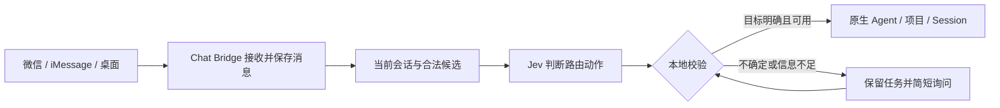

# 智能路由首版计划与评估

日期：2026-09-20。状态：首版配置和路由已实现，按最新要求保留 Vercel、OpenRouter 两种入口，移除 Jev for hood。验证后的 Key 保留在输入框，可显示／隐藏；用户已验证 OpenRouter 连接，中文路由准确率仍待实际评测。Vercel 免费期停用规则仅作用于 Vercel。实际范围与验证见 [ADR 005](decisions/005-semantic-routing.md) 和 [验证记录](verification/smart-routing-2026-09-20.md)。以下保留最初的设计与验收计划。

目标：用户用自然语言描述任务，Chat Bridge 自动选择 Agent、项目和会话；连续对话保持在同一原生会话，能够自然地新建、返回旧会话或退出项目。

建议采用**会话连续性优先的自然语言路由**。先理解消息和当前任务的关系，再决定目标。默认的 Agent 分工只用于新任务，不因为一句话从“规划”变成“写代码”就迁移正在进行的对话。

## 1. 现有基础与本次范围

- 已有六个 Agent 适配器：Codex、Claude Code、Cursor、Grok、OpenCode、Hermes。进入候选集合还必须满足当前安装、登录和连接状态，以及目标操作所需能力。Gemini 尚未接入，不能仅靠增加路由配置获得 Deep Research 能力。见 [实施进度](implementation-status.md)。
- 后端 `/new` 已支持保留项目、清除会话；`/project none` 已支持清除项目和会话。桌面也已有“新建无项目会话”。本次主要增加自然语言入口及明确反馈，复用这些状态转换。见 [core.ts](../bridge/src/core.ts) 和 [ChatView.swift](../apps/macos/Sources/ChatBridge/ChatView.swift)。
- 保留同一绑定用户跨微信、iMessage、桌面共享当前目标的产品行为。仅浏览列表不切换；明确选择或语义路由成功才更新目标。跨入口的切换按本机接收顺序生效，回复仍返回原消息来源。
- 本提案提出试验性模型路由，调整早期设计中“不增加路由模型”的范围。开发时同步更新相关设计记录；本文件不把提案标为现有能力。

首版仅负责目标选择和会话管理。跨 Agent 交接、一个提示词自动拆成多个 Agent 的任务链、A2A 协议均后置。

## 2. 用户可以怎样说

下表为预期行为，不要求用户记住固定句式。理解时结合当前目标、近期对话及真实项目／会话目录。

| 用户表达与前提 | 预期行为 |
| --- | --- |
| 当前正在改代码：“继续，按第二种方案改” | 发送到原 Agent、原项目、原 Session。 |
| 在同一任务中：“先分析一下风险”“好，现在实现” | 仍在原 Session 连续执行，角色偏好不触发切换。 |
| “接着做昨天微信断连的那个任务” | 唯一匹配时恢复该任务原生 Session 及其 Agent、项目；多个候选时询问。 |
| “让 Claude 在 chat-bridge 新开会话，分析重连方案” | 在 Claude Code 可访问的对应项目创建新会话并发送任务；项目不存在或不可访问时说明原因。 |
| 当前在项目 A：“在这个项目另开一个会话” | 保留 Agent 和项目 A，清除旧 Session；等收到实际任务再创建。 |
| 当前在项目 A：“退出项目，新聊一个问题：帮我写封邮件” | 清除旧项目和 Session，按新任务默认偏好选择可用 Agent，创建无项目会话并发送。 |
| 当前在项目 A：“另聊一件事，帮我写一封请假邮件” | 在上下文明确属于独立、无项目的新任务时自动创建无项目会话；不要求出现“退出项目”关键词。 |
| “修一下商城的支付错误” | 按项目语义匹配商城项目；存在多个商城项目或无法确定是在续聊时，仅询问缺失的信息。 |
| “切到 Claude” | 恢复 Claude Code 上次使用的目标；没有历史目标则进入无项目待新建状态；不把导航话语当成任务。 |
| “看看我有哪些项目” | 展示可用项目及“无项目”入口，不修改当前目标。 |
| “不要切到 Claude，继续改这里” | 保持当前目标；否定、引用及代码中的 Agent 名称不作为切换指令。 |
| “换 Cursor 接着刚才的上下文做” | 识别为跨 Agent 交接；首版说明尚未支持自动交接，提供留在原会话或另开会话的选择，不宣称新会话已有旧上下文。 |

三个选择原则：

1. **明确意图优先。** 用户指定的 Agent、项目、会话及新建要求优先于默认偏好；指定目标不可用时说明原因，不静默换一个执行。
2. **继续任务保留绑定。** 没有新的明确选择时，续聊使用原 Session。识别出独立新任务才重新分配；“像是在写代码”不足以成为迁移理由。闲置、重启或换消息通道不会自动新建。
3. **不确定时保留原文，问一个小问题。** 最多列出两三个可辨认的候选，附 Agent、项目及会话信息；用户回答后继续提交原始任务，不要求重新输入整段 Prompt。

项目意图必须区分“未指定”“明确无项目”“指定某项目”。“未指定”由上下文判断继承还是匹配；“明确无项目”会清除绑定。不能用一个空值同时表示这三种含义。

## 3. 最小实现方案

精确斜杠命令和有效的菜单选择继续由本地逻辑直接处理。自然语言通常调用一次 Jev。逻辑上先判断续聊／新任务／导航，实际请求可从完整动作候选中选择，不必为了三个层级分别调用三次模型。

给模型的内容保持精简：本条消息、当前绑定、当前任务最近几轮公开对话，以及候选项目／会话的名称、少量描述和必要历史片段。优先使用 Bridge 已有记录，适配器支持时读取有限的原生历史；缺少历史时承认信息不足。首版不引入另一个模型生成摘要，也不默认上传整个仓库或所有历史。

**Jev 选择由代码构造的完整合法动作。** 例如“向当前会话发送”“恢复会话 S 并发送”“在 Agent A 的项目 P 新建并发送”“只切换到 Agent A”“列出项目”“需要澄清”。动作绑定完整的 `agent + mode + projectId + sessionId/creationKey`；不得把分别猜出的三项拼接，避免跨 Agent 使用错误的项目或 Session ID。不同 Agent 的同名项目不自动合并。

候选少时完整提供。历史会话较多时，结合当前会话、名称／别名、近期记录及有限历史片段筛选，始终保留“没有合适候选”。候选可能漏掉目标时，可扩大一次查找范围；仍不足则询问，不能强制从错误集合中选一个。真实目录及能力决定可选动作，模型不生成路径或原生 ID。

Jev 的 Choice 适合从已知候选中选择；同一请求的多个问题独立求值，项目与会话的从属关系仍需程序保证。其 confidence 反映选项概率分布的集中程度，不等于实际正确率；自动执行门槛必须用中文样本校准。[Choice 文档](https://docs.typesafe.ai/primitives/choice)、[Confidence 文档](https://docs.typesafe.ai/confidence)。

只导航的消息不送入执行 Agent；同时包含选择和任务的消息，在确定目标后保留用户原文送入该会话。首版不依赖 Jev 重写任务正文。切换或新建时回一行目标，例如“已在 Cursor · 商城项目 · 新会话开始”；普通续聊避免重复提示。

**状态处理是主要工程工作：**

- 先持久化消息、接收顺序及待路由状态，再异步调用 Jev；禁止在 SQLite 同步事务内等待网络。收件游标与待处理消息一起落盘，重启后仍能继续。
- 同一用户的选择事件有序处理。前一条切换完成后，后一条才读取生效的目标；新建尚未完成时复用同一个创建预约，防止连续消息创建多个 Session。
- 模型返回后重新核对选择版本、身份绑定、候选 ID 和当前能力。状态过期则重新判断或询问，不能让迟到结果覆盖用户的新选择。
- 校验成功后，原子保存选择及带冻结目标的任务，再交给现有执行队列。沿用事件去重和“执行结果不明时不自动重发”的行为；不承诺外部系统能够严格恰好执行一次。
- 澄清记录复用现有 SQLite，保存原文、候选、来源、选择版本及有效期。等待时，该用户后续依赖上下文的消息暂存；有效回答或取消可以解除等待，明确的新选择会取消旧澄清。旧候选过期后不能把数字回复当成新任务误发。
- API 超时、限流或返回无效结果时，不向猜测目标发送。保留消息，允许选择当前目标、手动选择或重试路由；失败的推理不会改变当前绑定。

这些逻辑可放在少量路由函数和一个 Jev 请求模块中，接入现有 `core.ts`、`service.ts`、收发件箱和适配器。无需新增服务、数据库或独立的任务编排框架。

## 4. 默认配置与试验模型

首版设置只增加智能路由开关和少量任务偏好，继续使用现有默认 Agent。

| 配置 | 建议起点 |
| --- | --- |
| 规划类新任务 | 偏好 Claude Code。 |
| 实现类新任务 | 偏好 Cursor；用户也可改为 Codex 等已接入入口。 |
| 研究类新任务 | 从当前确实具备所需研究能力的入口选择；Gemini Deep Research 待接入后才能启用。 |
| 其他新任务 | 使用现有默认 Agent。 |

这些是用户可修改的分工偏好，不是关于哪家 Agent 能力最强的结论。新任务先满足明确指定的目标和项目可访问性，再应用角色偏好及全局默认。仅偏好不可用时，可选择兼容的默认 Agent 并说明；没有兼容目标则询问。已有 Session 的 Agent 不受偏好变化影响。首版不增加每个项目、每个会话各自一套配置。

试验使用 Vercel AI Gateway 上的 `typesafe-ai/jev`。截至 2026-09-20，模型页面标注免费促销，**2026-09-25 结束**；需要 Vercel Gateway 的凭据及账户可用性验证，不能当作长期免费服务。试验需设置早于促销结束的停用时间，关闭付费后备；延长试验前重新核对价格。这里只讨论路由推理费用，执行 Agent 沿用其原有计费。[Jev 模型页面](https://vercel.com/ai-gateway/models/jev)、[Gateway 接入文档](https://vercel.com/docs/ai-gateway/sdks-and-apis/typesafe)。

本机无需加载路由模型；增加的工作主要是目录筛选、少量状态读写和网络请求。实际内存增量、延迟、限流与中文效果要测量，不能仅凭在线模型就承诺性能。

## 5. 实施顺序与验收

| 步骤 | 交付内容 | 验证方式 |
| --- | --- | --- |
| 1. 固定行为 | 把上面的意图、状态转换、候选合法性写成用例；明确共享当前目标和无项目语义。 | 用模拟适配器验证：新建保留项目、退出项目清空、原 Session 恢复、只浏览无副作用。 |
| 2. 先测 Jev | 做只输出路由建议、不真正派发任务的评测工具；使用线上免费入口。 | 准备约 200 个带上下文的中文样本，按表达家族分为校准集与独立验收集；记录错误、延迟和用量。 |
| 3. 接入主流程 | 增加持久化待路由、异步判断、候选校验和澄清；复用现有任务创建、去重和队列。 | 测试连续来信、两通道同时来信、过期选择、重复消息、创建中断、推理中断及执行结果不明。 |
| 4. 完成用户入口 | 配置角色偏好；加入目标提示和自然语言纠正；远程菜单提供无项目入口。 | 同一句话分别验证“只导航”和“导航并执行”；纠正仅作用于尚未派发的任务，已派发任务明确提示状态，不自动重发。 |
| 5. 开启小范围试用 | 先观察真实输入下的建议，评测达标后启用自动选择；保留路由开关。 | 在可运行的原生 Agent 上核对实际会话 ID 和历史；进行十轮连续对话、返回旧会话及无项目新建验收。 |

步骤 2 未达到要求时，先调整候选信息与判定标准。不要通过提前引入多 Agent 编排、向量数据库或本地大模型来掩盖基础路由问题。

必须覆盖的序列与反例：

| 场景 | 必须观察到的结果 |
| --- | --- |
| 连续十条消息包含规划、实现、测试，但属于同一任务 | 十条都指向同一原生 Session；角色关键词不会拆散对话。 |
| 相同的“继续改一下”，分别出现在两个不同任务之后 | 各自恢复正确上下文；不是根据最后一句文字独立分配。 |
| 项目内旧会话 → 同项目新会话 → 无项目新会话 → 返回旧会话 | 每次项目与原生 Session ID 都符合意图，旧会话仍可找回。 |
| 同名项目、相似会话标题、未提项目的编码请求 | 有足够上下文才自动选择，否则只询问需要补充的一项。 |
| 否定、引用、代码块、口语及语音转写中的 Agent 名称 | 不把被讨论的名称误认成路由命令；转写有歧义时询问。 |
| 新话题未出现“新建／退出”字样 | 明确独立任务仍可进入新目标；与当前任务关系不清时询问。 |
| 模型推理期间另一入口切换、目录失效、Agent 掉线 | 迟到结果无法覆盖新选择或发送到失效目标。 |
| 重复投递、重启、澄清过期、免费期结束 | 不重复派发、不丢原始任务、不静默转付费。 |

建议首轮验收目标：自动决策准确率至少 98%，明确无歧义样本中至少 80% 无需追问；验收集中不得出现串项目、错误恢复旧会话或重复派发。准确率和覆盖率一起报告，避免靠频繁询问得到虚高准确率。目标是试验门槛，并非已经达到的结果或线上可靠性保证。另记录路由耗时 P50／P95、失败率和本机资源增量；耗时过高时先减少无关上下文。

## 6. 对方案的评价

| 维度 | 判断 | 尚需证据或限制 |
| --- | --- | --- |
| 语义化 | 设计上足够覆盖首版：理解指代、否定、续聊、新话题，以及只导航和实际任务的区别；不要求记忆指令格式。 | Jev 的中文效果与候选召回尚未实测，不能把设计覆盖等同于识别准确。 |
| 用户操作 | 简单：通常直接说任务，目标变化时看到一句反馈，只有歧义时作一次小选择。 | 历史标题相似、项目缺少描述时会多问，需根据真实输入改进候选信息。 |
| 实现复杂度 | 中等且范围可控：复用原生会话、现有数据库和执行队列。 | 异步路由的持久化、有序提交和过期判断是必要工作，不能缩成一次 API 调用。 |
| 上下文连续性 | 同一任务绑定同一原生 Session，可直接解决连续 Prompt 被分到不同 Agent 的问题。 | 原生历史可用性及窗口限制仍由执行 Agent 决定；跨 Agent 共享上下文不在首版保证内。 |
| 资源与费用 | 在线推理符合先避免本地模型资源占用的偏好。 | 免费有明确期限；网络延迟、限流及促销后的选择仍需评估。 |
| 多 Agent 配合 | 首版有意控制范围：先让每个任务找到合适的单个入口。 | 自动研究→规划→执行需要下一阶段的任务依赖、交接材料与完成条件；是否采用 A2A 届时再决定。 |

建议按此范围推进：先证明“少操作、少误路由、不断上下文”，再评估跨 Agent 接力。首版的语义化取决于上下文判断与澄清质量；保持实现简单，依赖于让模型只选择合法动作，并继续使用项目已有的会话与任务机制。
