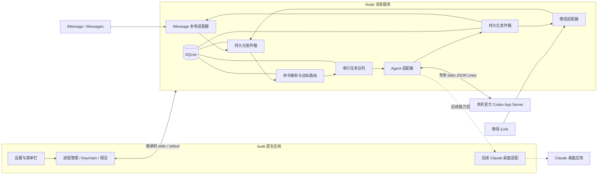

# Chat Bridge 可实施技术方案

版本：1.5 · 调研基准：2026-09-18 · 状态：实施中；实际完成范围见 [实施进度](implementation-status.md)。

2026-09-20 路由范围更新：按用户要求增加可选的 Vercel／Jev 语义路由，默认关闭；后文“不增加路由模型”的早期约束由 [ADR 005](decisions/005-semantic-routing.md) 调整。

本方案将产品要求、实施决策、已核验事实和待验证能力分开记录。配套的 [验证与验收清单](verification-checklist.md) 给出了步骤、通过标准和发布门槛；[研究证据](research/evidence-2026-09-18.json) 保存实际运行结果、依赖版本和源码指纹。

**当前决定：SwiftUI／AppKit 原生应用，加随包 Node.js／TypeScript 消息服务。用户已明确接受 Codex 先使用本机官方 App Server，由 Chat Bridge 管理会话；暂不接管已有桌面会话。** 具体约束与实现见 [ADR 003](decisions/003-managed-codex-runtime.md)。Claude Code、Chat、Cowork 继续分阶段接入。ACP 仍为可选协议，不增加路由 Agent。

此前默认 control socket 不可用和桌面 UI 操作受限的研究结果保留。它们说明原桌面接管方案未通过，不再作为已获用户批准的 Codex 独立运行时执行的前置条件。后文桌面项目、全量历史及 Claude AX 驱动属于后续目标，不能解释为 0.3.0 已实现。

## 1. 产品范围与成功标准

| 编号 | 已确定的要求 |
| --- | --- |
| R01 | 只支持 macOS；桥接服务在用户电脑上运行。 |
| R02 | 当前通道为 iMessage、微信；Telegram、WhatsApp 显示 Coming soon。 |
| R03 | 默认 Agent 为 Codex，可选择 Claude；Cursor、Grok、OpenCode、Hermes Agent 显示 Coming soon。 |
| R04 | Claude 的 Code、Chat、Cowork 分阶段接入；具体模式按本机版本能力显示。 |
| R05 | 没有选择目标时，第一条普通消息在默认 Agent 中创建无项目的新 Session。 |
| R06 | 未显式切换 Agent、模式、项目、Session 或新建会话时，持续使用原 Session。重启、闲置、切换通道不自动新建。 |
| R07 | 同一所有者绑定的 iMessage 和微信共用一个当前目标；回复返回触发该次任务的通道。 |
| R08 | 列出并切换 Agent、项目、Session；允许项目为空，并能单独列出无项目 Session。 |
| R09 | iPhone 使用手机号，Mac Messages 使用邮箱收发；必须验证自发自收、同步副本与回声。 |
| R10 | 应用提供“锁屏后台保活”开关；保活不等于解锁，也不保证所有 GUI 操作能在锁屏时执行。 |
| R11 | iMessage 使用 imessage-kit；微信遵循腾讯 openclaw-weixin 所展示的 iLink 接入方式。 |
| R12 | 复用统一消息组件；首版以文本菜单、图片和文件为基础，不依赖商业平台专属卡片。 |
| R13 | 菜单栏使用紧凑 Agent 头像组，默认 Codex、Claude、Cursor，右侧「＋」配置 Agent。Cursor 仍为 Coming soon，仅开放配置和展示。 |
| R14 | 点击可用 Agent 头像，展开该 Agent 的当前 active Session；没有时立即创建无项目新 Session。反复点击不重复新建。 |
| R15 | 头像下展开聊天面板；背景为很淡的磨砂并柔和淡出，消息卡和输入框使用更明显的局部磨砂。移除浮层标题行，顶部消息逐渐模糊淡出。 |
| R16 | 默认三个 Agent 与＋依次交错重叠，每处重叠边缘有透明圆弧留白；悬浮时整组展开为四个独立圆形按钮，移开后整组收拢。悬浮不触发会话操作，菜单栏实际占位随图标组在 72–102 pt 之间变化，不预留展开空白。 |
| R17 | 首版不强制使用 ACP，不新增负责转发的 AI Agent；通道、业务路由与 Agent 接入分层，ACP 仅为未来可选适配。 |
| R18 | 显示 Agent 面向用户的过程说明、中间回复和最终答案；本机实时更新同一消息，消息通道顺序发送完整正文消息。思考、工具调用、工具结果和日志不作为正文输出；完成时不重复追加。 |

首次安装完成后，用户从任一已绑定通道发一条消息，应用应明确反馈任务已接收，使用正确 Agent 和 Session 执行，并把结果发回原通道。随后换用另一通道继续说话，仍使用同一个原生 Session。

本地运行的是消息桥接与桌面控制。模型推理、Chat 数据及 Cowork 的实际执行位置由原应用和账号能力决定；界面记录 local／cloud／unknown，不将“连接桌面应用”宣传为完全离线或全部本地计算。

首版只做单个 macOS 用户、单个所有者、每种通道一个绑定；不做群聊、多人共享权限、云端中转服务或任意插件市场。首次验收设备为 Apple Silicon、macOS 14+；最低系统和 Intel 支持需要实际 Agent 兼容性与真机结果，不能由构建成功推导。

## 2. 技术选型与依赖基线

| 层 | 决定 | 原因 |
| --- | --- | --- |
| 桌面界面 | SwiftUI；必要处使用 AppKit | 菜单栏、设置、系统权限与原生辅助功能接口直接集成。 |
| 原生能力 | ServiceManagement、IOKit、Security、ApplicationServices | 登录启动、保活、Keychain、Accessibility 自动化。 |
| 消息服务 | 随包分发 Node.js 24.21.0 + TypeScript | 可直接复用通道库；用户不需要另外安装 Node。 |
| 通道统一层 | chat 4.40.0 | 统一消息事件、附件和卡片表达。 |
| iMessage | @photon-ai/imessage-kit 3.0.0 + 本地适配器 | 保留指定的 Mac 本机接入方式。 |
| 微信 | chat-adapter-weixin 0.1.4；腾讯协议作为对照 | 复用公开协议客户端；本地事务管理收件与游标，见第 7 节及 ADR 002。 |
| 数据库 | SQLite，Node 使用 better-sqlite3 12.11.1 | Kit 的 Node 路径本身也使用它；避免两种数据库绑定。 |
| 密钥 | macOS Keychain | 微信 token、配对秘密和本地加密密钥不写明文配置。 |
| 分发 | Developer ID 签名、公证的应用包 | 首阶段直接分发；不把 App Store 上架作为前置条件。 |

这些是核验时的版本基线，开发时写入精确版本及锁文件。依赖更新单独执行兼容性回归，不使用启动时自动升级或 `npx latest`。Node 官方当前将 24 系列列为 LTS；两种 macOS 架构的发布文件均存在；实施阶段已校验并嵌入 arm64 24.21.0，x64 尚未实测。原调研证据中的“未安装”保留其执行时点含义。[Node 发布记录](https://nodejs.org/en/about/previous-releases)

Chat SDK 可在本机 Node 服务运行，不要求部署到 Vercel。其卡片文本转换会省略 Actions，需补充一套共同的文本操作渲染器。[官方运行说明](https://vercel.com/kb/guide/the-complete-guide-to-chat-sdk)、[固定版本源码快照](https://github.com/vercel/chat/blob/61b98fca00e7a2c2489e99fc2b9ea1587a8f30b9/packages/chat/src/cards.ts)

不选择 Electron：产品只面向 macOS，系统权限、生命周期和桌面自动化是核心；加入 Chromium 并不能解决这些问题。也不全部改写成 Swift：会重复实现已经存在的 TypeScript 通道能力。

## 3. 进程与模块



- Swift 主进程支持菜单栏与看板两种展示状态。看板打开时使用 `NSApplication.ActivationPolicy.regular`，在 Dock 显示应用图标；关闭看板或切回菜单栏浮窗时使用 `.accessory`。关闭窗口后继续运行，明确退出应用才停止消息桥接。
- 头像下的透明聊天面板由原生 NSPanel 承载，显示当前 Agent 已绑定 Session；Codex 当前绑定本应用管理的官方运行时会话。本机输入也进入同一个路由和任务管线。详细行为见 [菜单栏与透明会话交互](menubar-interaction.md)。
- 主进程启动一个 Node 子进程，通过继承的双向管道传 JSON Lines。stdout 只输出协议，日志走 stderr；不监听公网或本地 HTTP 端口。
- Node 是桥接数据库唯一写入者，负责命令、收件箱、路由、任务和发件箱；Swift 不同时打开该数据库写入。
- Codex 官方运行时由 Node 创建并管理生命周期，无须控制其桌面窗口。未来 Claude 的原生 UI 操作由 Swift 串行执行，防止两项任务抢焦点。
- 原生密钥通过已建立的管道按需交付，不能放入命令行参数或日志。允许的原生方法固定为 Keychain、权限状态、保活状态、Agent 操作，不提供任意 shell 执行接口。
- Node 崩溃后主进程以 1、2、4、8、30 秒退避重启，连续五次失败停止重试并显示故障。每次启动先恢复任务状态，再开放新消息消费。
- 主进程与 Node 采用父子生命周期；父进程退出时子进程关闭。不能同时存在两个消费同一通道的实例。

IPC 每条请求包含 `protocolVersion、requestId、method、params`；响应包含相同 requestId 和 `result` 或结构化 `error`。正文限制 1 MiB；附件只传受控文件标识，不通过 IPC 传整份二进制。方法超时不等于外部副作用没发生。

本机输入携带用户点击发送时的 selectionVersion。Node 在接受消息前核对当前版本，若已被手机或其他入口切换，拒绝为 STALE_TARGET 并保留草稿；不能让旧输入框静默发送到新目标。打开另一个 Agent 的过程中，本机输入暂不可发送。

建议实现目录如下。当前阶段用更少的文件实现最小业务合同，具体差异见实施进度。

```text
apps/macos/                 SwiftUI、菜单栏、权限、Keychain、保活、AX 驱动
bridge/src/channels/       iMessage、微信适配
bridge/src/agents/         Codex、Claude 及能力检测
bridge/src/core/           路由、命令、任务、收发件箱、审批
bridge/src/storage/        SQLite 迁移、查询、Chat SDK StateAdapter
bridge/src/messages/       统一菜单、状态和文本降级
patches/                   必要且最小的第三方依赖补丁
tests/                     路由与恢复测试、适配器契约测试、真机步骤
docs/                      本方案、验收清单、证据
```

## 4. Agent 接入：保持同一个会话身份

### ACP 决策

首版采用应用内部的小型 AgentAdapter 接口，不把通道事件或全部内部 IPC 包装成 ACP，也不增加一次模型调用来决定路由。普通正文原样交给明确绑定的原生 Session；切换命令由确定规则处理。

ACP 在本项目指 Agent Client Protocol。未来增加 ACP 适配时，Chat Bridge 扮演 Client，外部适配器或引擎扮演 Agent。它可以统一创建／恢复、提示、更新、取消与审批，但不替代所有者绑定、去重、持久化队列或回复路由。[协议](https://agentclientprotocol.com/protocol/v1/overview)

当前 Codex ACP 适配器会启动 App Server，Claude ACP 适配器基于 Claude Agent SDK；不能据此声称接管了桌面应用原有 Session。桌面接入仍先验证原生 ID 与双向可见性，且 Claude Code 的成功不代表 Chat／Cowork 已接通。[Codex 适配器](https://github.com/agentclientprotocol/codex-acp)、[Claude 适配器](https://github.com/agentclientprotocol/claude-agent-acp)

用户已接受 Codex 由 Chat Bridge 管理独立编码会话。直接接入其官方 App Server 即可，不需要先增加 ACP 转换。首版不安装 ACP 运行时，不构建通用插件框架。通道分层见 [ADR 001](decisions/001-agent-adapters-and-acp.md)，更新后的执行范围见 [ADR 003](decisions/003-managed-codex-runtime.md)。

### 4.1 统一接口

每个适配器实现以下业务接口；这些是应用内部接口，不宣称第三方应用存在同名 API。

| 方法 | 返回或行为 |
| --- | --- |
| `probe()` | 安装路径、bundle ID、版本、登录状态、能力、锁屏能力、故障原因。 |
| `listProjects(cursor)` | 原生项目 ID、类型、名称、分页游标、列表是否完整。 |
| `listSessions(projectFilter, cursor)` | 原生 Session ID、所属项目或 null、模式、运行状态、执行位置。 |
| `createSession(target, creationKey)` | 原生 Session ID，或明确的“不确定／不支持”结果。 |
| `sendTurn(sessionId, input, requestId)` | 绑定现有 Session；返回原生 turn ID 或发送待确认状态。 |
| `observe(sessionId, checkpoint)` | 用户可见进度、最终答复、审批、错误；提供来源和完成可信度。 |
| `readMessages(sessionId, cursor)` | 分页读取该原生 Session 的用户可见消息，用于头像下聊天面板；明确历史是否完整。 |
| `cancel(sessionId, turnId)` | 取消指定任务，不取消当前 UI 碰巧显示的其他任务。 |
| `answerApproval(approvalId, decision)` | 仅对仍有效且已绑定的原生审批请求作答。 |

能力不能用一个 `supported=true` 表示。至少包含 `canListProjects、canListSessions、canCreateProjectless、canResumeExactSession、canReadHistory、canSend、canObserveCompletion、canCancel、canRelayApproval、worksWhileLocked`。缺失的能力在界面和命令中给出明确原因。

### 4.2 Codex

OpenAI 的 app-server 文档给出了 thread 列表、读取、创建、恢复、turn 发送／取消和事件协议；这些可以作为适配基础。协议及部分传输仍有实验性边界，使用本机对应版本生成的 schema。[Codex App Server](https://learn.chatgpt.com/docs/app-server)

当前实现：

1. 根据 bundle ID 找到应用随包 Codex 可执行文件，启动由 Chat Bridge 独立管理的 stdio App Server。
2. `initialize → initialized → account/read` 验证协议与已有登录；未就绪不发送任务正文。
3. 使用 `thread/start` 创建无项目会话，持久化官方 thread ID；连续消息保持该 ID，重启后以 `thread/resume` 恢复。当前无项目会话共用应用专用的 `Workspaces/Default` 目录，不使用用户 Home。
4. 以匹配 thread／turn 的 `turn/completed` 为完成依据；停止等待 `turn/started` 后调用 `turn/interrupt`。Bridge 启动／恢复会话默认使用 `sandbox=danger-full-access` 与 `approvalPolicy=never`；桌面端持有的会话经原生队列执行时沿用原应用权限。运行时仍发出的审批只允许单次批准或拒绝，重启后失效。
5. 已通过本机 schema 与真实调用验证 `project/list`／`project/read`，启用实验性协议。`thread/list` 枚举本机 App Server、CLI、VS Code 会话；优先原项目 ID，再兼容旧版应用项目归属与目录信息。`thread/read` + `thread/turns/list` 读取最近 25 轮可展示内容，浏览不恢复会话。发送时恢复原 ID／cwd，完成后关闭桥接自身 App Server 释放占用。

本机 `codex-cli 0.155.0-alpha.9` 已完成真实创建、回复、续聊、进程重启恢复和停止验证，证据见 [运行时验收](verification/codex-runtime-2026-09-18.json)。本次只验证自己创建的测试会话。

`thread/list` 返回的 cwd 只能作为工作目录线索，不能直接当作桌面应用的原生项目列表。项目枚举使用实际可用的项目接口或原生 UI；没有经验证的项目接口时，不能在方案中虚构 `project/list`。本对话中 Codex 自带的管理工具属于当前宿主能力，也不自动成为独立 Chat Bridge 可调用的公共接口。

### 4.3 Claude Code、Chat、Cowork

Claude 的官方深链支持创建页面、跳转已有 Chat／项目和预填内容，但不是完整的收发接口。Code／Cowork 新会话通过链接传入目录时还会出现目录确认。[Claude 深链说明](https://support.claude.com/en/articles/14729294-open-claude-desktop-with-a-link)

2026-09-19 用户确认本次只接入 **Claude Code**。使用官方 Agent SDK 0.3.270 的 `listSessions`／`getSessionInfo`／`getSessionMessages` 读取本机会话，项目按 Code 的实际 cwd 分组。`query({ resume })` 继续原 ID，新会话预留 UUID 并在原生 init 核对；CLI 安装与登录单独检测。2026-09-20 起，新建与恢复会话默认使用 `permissionMode=bypassPermissions`、`allowDangerouslySkipPermissions=true`；仍触发的工具审批通过 `canUseTool` 单次回传。停止通过 `interrupt`，结束后关闭 query。Chat／Cowork 的后续接口另行验证，不使用认证 cookie 抽取。

- Claude Code 先接入；`claude --resume` 和 Agent SDK 单独启动的会话不自动视为 Desktop Code 会话。
- Chat 接入原生 Chat／项目模型；没有项目的 Chat 直接显示在无项目列表中。
- Cowork 接入任务会话与其工作目录／附件授权。不能用某个文件夹冒充原生项目，也不能默认为已有目录授权可经深链重用。
- 若安装版本已有合法、公开且可复用的桌面控制接口，仍需通过同 ID 双向可见性测试，才替换 AX 驱动。
- Channels 可推送事件到启用该功能的 Claude Code 会话，但目前属于研究预览，并有插件准入和按会话启用要求；不把它作为接管任意 Desktop Chat／Cowork 的通用通道。[Claude Channels](https://code.claude.com/docs/en/channels)
- 最新官方说明中，部分账号正在合并 Chat 与 Cowork 体验。探测原生能力后再显示模式，不硬编码三个必然存在的页签；合并版本可以显示“Claude 对话／任务”，保留 Code 单独模式。[官方变化说明](https://support.claude.com/en/articles/13947068-assign-tasks-from-anywhere-in-claude-cowork)

### 4.4 Accessibility 驱动的实施约束

驱动维护“应用版本范围 → 控件语义定位规则”。使用 AX role、identifier、标签和容器关系定位，不能以窗口坐标作为主路径。

一次发送的步骤：取得应用操作锁 → 检查未锁屏、权限与登录 → 导航原生 Session → 二次核对 Session ID／可验证定位信息 → 保存发送前消息锚点 → 设置输入框内容 → 检查读回值 → 发送一次 → 观察新用户消息／运行状态 → 保存原生发送证据 → 释放操作锁。

- 导航默认超时 10 秒；发送确认默认 15 秒。超时后先核对原生界面，不能直接再点一次发送。
- 只用 AX 设置文本；需要剪贴板的版本不在基础兼容清单内，避免覆盖用户剪贴板。
- 列表须支持分页／滚动到末尾，区分“加载中”“仅已加载部分”“完整”。重名项目／会话需要原生 ID 或可重复定位的原生链接；拿不到唯一定位依据时不开放该条目的远程切换。
- 优先监听 AX 变化事件，必要时低频读取。文本停止变化不等于任务完成，必须同时观察可靠的完成状态／停止控件变化；仍无法判定时显示“状态待确认”。
- 原生长答复需要滚动读取或应用提供的复制输出路径；不能把虚拟列表当前可见的一小段当作完整结果。
- 应用更新后先做只读能力自检；定位不再唯一时停止自动发送，保留队列并提示兼容性故障。
- GUI 驱动锁屏期间不执行点击／输入；数据收取和排队仍可继续。用户在原应用手动切换窗口时，驱动暂停并重新核验目标，不能把消息发到新窗口。

只在独立验收会话中验证这些动作，不借用用户当前进行中的任务。若某模式不能稳定取得唯一 Session 或完整最终结果，该模式必须显示不可用并阻止发布其“已支持”声明。

## 5. 项目、会话与路由状态

### 5.1 统一身份

内部 Agent 使用 `codex | claude`，Claude 模式独立保存。项目使用 `(agent, mode, nativeProjectId)`；Session 使用 `(agent, mode, nativeSessionId)`，标题只用于展示。

项目类型分为原生项目、工作区目录和无项目。不得把不同 Agent 的同名项目合并，也不能把 Cowork 文件访问范围当作 Chat 项目。没有项目概念的模式直接展示 Session 列表。

无项目在数据中是 `project_id = NULL`。底层代码引擎要求 cwd 时，使用应用管理的工作目录；当前 Codex 无项目会话共用 `Workspaces/Default`，对话 ID 分离、文件目录共享。该目录不注册为用户项目，不隐式使用上一次仓库、用户主目录或进程启动目录。

项目与 Session 保留内部稳定 ID，标题只用于展示。消息通道中的项目／会话列表不展示内部 ID，只显示 `01 名称`、`02 名称`，编号对应本次列表保存的 ID 快照，后续目录排序变化不会改变这次编号的含义。任务和审批仍使用独立的 `J…`、`A…` 编号；本机项目选择器继续使用内部 ID 定位。

### 5.2 选择状态转移

| 当前状态／动作 | 结果 |
| --- | --- |
| 没有选择，收到第一条有效普通消息 | 在默认 Agent、默认模式、无项目目标中预约并创建 Session。 |
| 已绑定 Session，收到普通消息 | 给同一 Session 新增一轮。 |
| 仅打开 Agent／项目／Session 列表 | 只读操作，不改变任何选择。 |
| 显式切换到不同 Agent 或模式 | 优先恢复该 Agent／模式记录的 active Session 及其项目；确实没有时选择无项目目标。远程命令与菜单栏头像均在下条普通消息创建，浏览保持只读。 |
| 点击菜单栏中可用 Agent 的头像 | 展开其 active Session；不存在时显示空会话，下条普通消息创建。 |
| 重复选择当前 Agent／当前模式 | 无操作，保留原 Session。 |
| 选择不同项目 | 切换项目并清除 Session；下条普通消息在该项目创建新 Session。 |
| 选择“无项目” | 清除项目和 Session；下条消息创建无项目 Session。 |
| 选择某个既有 Session | 原子切换到它所属的 Agent、模式和项目。 |
| `/new` | 保留当前 Agent／模式／项目，清除 Session；下条普通消息才真正创建。 |
| 修改设置中的默认 Agent | 不打断已经选择的 Agent 或当前 Session；只影响以后无选择的起始状态。 |
| 重启／断线／闲置／换用通道 | 恢复已保存选择；不重建 Session。 |
| 原 Session 删除、归档或无法恢复 | 保留绑定并提示用户选择／新建；不悄悄换到另一个 Session。 |

第一次选择 Claude 时建议模式为 Code；后续显式模式选择持久化。每个 owner／Agent／模式保存独立的 active Session 指针，所有通道仍共享一个全局当前目标。头像选择成功后同步全局目标；单纯打开配置、固定图标或查看 Coming soon 不改变目标。进入一个尚未通过能力检查的模式只展示原因，不清空现有可用目标。

这是 1.1 根据新增头像交互更新的规则：切到已有 active Session 的 Agent 时恢复它，不再一律清空重建。丢失、删除或不可读取的已知 Session 不属于“从未有会话”，仍按错误规则处理，不能自动替换。

### 5.3 并发和顺序

桥接无法获得两个社交网络全局一致的发送时间，统一以**本机持久化接收序号**排序。排序规则在 `/status` 与日志中可追踪。

1. 接收消息、去重、分配 `ingress_seq`，写入 inbox。
2. 同一所有者的路由事件串行处理。控制命令更新选择版本；普通消息冻结当时的 `selection_version` 和目标，后续切换不修改已接受消息。
3. 尚无 Session 时创建 `creation_key` 预约；该选择版本下的后续消息都指向这一预约。调用外部创建接口期间不持有数据库事务。
4. 创建成功后，事务内把预约和依赖它的任务绑定到原生 Session ID。
5. 每个 Session 同时只执行一轮，其余排队。不同 Session 可以各自运行，但共用 GUI 驱动的导航／输入仍串行。
6. 首版普通后续消息默认排在当前轮之后；不根据自然语言猜测要中途 steer。停止和审批使用显式命令。

创建或发送后发生崩溃、未得到响应时，状态是 `uncertain`。先用原生 ID、已记录用户消息 ID、发送前锚点等核对。无法确认时请用户在明确的任务卡上选择重试或取消；不以“网络重试”自动制造第二个会话或重复执行。

## 6. 远程命令和消息展示

配置完成后的教学消息：每次新绑定与命令指南一并落盘，通过同一通道的持久化发件箱自动发送。首次微信来信提供回复上下文前保留待发；iMessage 连接就绪后发送。重启／重连不重复，解绑取消待发消息；发送结果不确定时不自动重发。指南与 `/help`共用内容，只介绍当前已实现的命令及实际编号用法；指南包括已实现的项目与分页命令；仍未实现的重试能力不进入教学消息。

只解析开头完整匹配的命令；其余正文原样交给 Agent。中文菜单是同一操作的别名。普通消息中的“换一个项目看看”不擅自改变路由。

| 输入 | 行为 |
| --- | --- |
| `/help` | 展示可用命令与当前目标。 |
| `/agent` | 列出 Codex、Claude；其他 Agent 显示 Coming soon。 |
| `/agent codex`、`/agent claude` | 显式选择 Agent。 |
| `/mode`、`/mode code` | 查看／选择当前 Agent 支持的模式。 |
| `/project`、`/projects` | 列出当前 Agent 的项目，只显示编号与名称；没有项目时直接列出会话。 |
| `01`、`02` 等 | 在发出列表的通道选择对应项目或会话；选中项目后自动列出该项目的会话。 |
| `/project none` | 切到无项目，下一条普通消息新建会话。 |
| `/sessions` | 当前项目范围的会话，只显示编号与名称；无项目时列无项目会话。 |
| `/sessions all` | 当前 Agent／模式的所有可访问会话，只显示编号与名称。 |
| `/more` | 显示当前列表下一页；编号从上一页继续，例如 `09`、`10`。 |
| `/new` | 清除当前 Session，下一条消息新建。 |
| `/status` | 当前目标、运行／排队任务、通道和锁屏状态。 |
| `/stop J6M8` | 停止明确的任务；裸 `/stop` 只在当前 Session 恰有一个运行任务时生效。 |
| `/approve A8Q2`、`/deny A8Q2` | 对绑定的、未过期审批作答。 |
| `/retry J6M8`、`/cancel J6M8` | 处理失败／不确定任务；有可能已执行时先展示风险确认。 |
| `/continue J6M8` | 在用户已看到目标和内容摘要后，继续因排队过久而暂停的任务。 |
| `//...` | 将以 `/` 开头的普通内容转交 Agent，去掉一个 `/`。 |

列表每页 8 项，编号最少两位。每个通道账号／联系人只保留一份当前列表，内容与编号映射持久化；翻页不重新排序，允许选择已显示的较早页条目，拒绝未显示的后续页编号。列表从首次生成起 10 分钟有效，翻页不延长；选择版本或通道绑定版本改变后失效，提示重新发送 `/project` 或 `/sessions`，不会把失效／越界编号转发给 Agent。重启后仍在有效期内且目标未变的列表可继续选择。

选择项目只改变目标并显示该项目会话，不创建任务；没有会话时提示直接发消息新建。选择会话后清除列表，后续数字恢复为普通内容；选择期间发送其他普通文字也会清除列表并继续聊天。没有列表时单独数字始终作为普通内容。原生消息 ID 去重，重复投递选择消息不会二次切换或创建任务。内部 `/project P…`、`/use S…` 兼容本机选择器，用户指南不再展示这些 ID；旧 `/more M…` 提示重新获取列表。

首版只设计三种通用内容：选择列表、任务状态、审批请求。文本与未来按钮共用相同 action ID，不为每个平台复制业务逻辑。

```text
请回复编号进行选择：
01 chat-bridge
02 MyClip
```

回复 `01` 后显示该项目的会话：

```text
请回复编号进行选择：
01 分析应用需求
02 调整消息列表
```

再次回复 `01` 后确认 `当前会话：分析应用需求`，随后普通消息进入该会话。最新实现与验证见 [编号选择记录](verification/numbered-menus-2026-09-19.md)。

任务接受后立即返回 `J6M8 已接收 → Codex / S7K2`，这不代表已经提交给 Agent。公开过程说明与最终正文都要送达。当前 iMessage／微信发送端不支持原位编辑消息：每条原生正文消息完成后进入 outbox，按原顺序发送，不逐 token 刷屏；长消息沿用最多 1,800 UTF-8 字节、保持字素完整的分片和分片编号。这是产品上限，不是平台官方限制。附件形式的完整结果与跨分片 Markdown 围栏修复仍待实现。

原任务即使在用户切换 Agent 后完成，仍使用任务冻结的 Session 和回传地址，并在回复头标明来源。用户未授权的其他会话输出，不被后台全量转发。

## 7. 通道实施细节

### 7.1 iMessage

保留 `imessage-kit` 的读取、解析和发送实现，使用 Chat SDK 共同卡片模型与应用自己的可靠性层。0.2.0 的具体实现和限制见 [ADR 002](decisions/002-durable-channel-transports.md)。Kit 的 Node 数据库实现会加载 better-sqlite3，因此将该原生模块作为明确的生产依赖打包。[Kit 数据库源码](https://github.com/photon-hq/imessage-kit/blob/20a1536d7f56686b2973a27103949c5495955785/src/infra/db/sqlite-adapter.ts)

引导用户在手机和 Mac 分别选择手机号、邮箱；应用展示待绑定的两个标识，由用户完成双向校验。首次仅从绑定完成时刻开始消费，旧历史不触发任务。

配置辅助（2026-09-19）：邮箱和手机号字段记住用户在此 Mac 上的填写内容，下次作为可编辑默认值恢复；这些草稿不代表已验证或已绑定。首次使用需人工核对。当前系统可读的 Messages 账号配置只有内部账号 ID，公开脚本字典没有提供自己的邮箱／手机号；不通过联系人或历史聊天推断身份，也不把 Apple Account 登录邮箱直接视为 iMessage 发件邮箱。Mac 上列出的可接收手机号亦不能证明 iPhone 当前选用的发件号码。

配对交互按用户 2026-09-19 的要求调整为两步：① 点击「开始配对」，读取预检通过后，Mac 直接向配置手机号发送配对请求；② iPhone 核对发件邮箱，在同一对话回复 `OK`，Mac 自动完成绑定并发送命令指南。无需输入 `/pair`、`/confirm` 或再次点击本机启用。请求 10 分钟内有效，每次含独立请求编号用于匹配出站记录；用户只需回复 `OK`（忽略大小写与首尾空白）。读取预检失败不会发信，发送结果不确定时不自动重发。

只接受本次请求的发信回声之后、来自精确手机号与同一单聊的新 `OK`，同时核对消息时间；旧历史、同步晚到的旧时间消息、群聊、SMS、自动回复、附件、转发、编辑和恢复的消息均不能完成配对。引用其他消息的 `OK` 不计入确认。Mac 请求必须被标为本机发送，手机回复必须为来信；方向不可靠时停止。确认用的 `OK` 不交给 Agent，随后同一批到达的消息正常处理；绑定与读取游标持久化，重启不重复发送配对请求或命令指南。

发送库没有指定发件邮箱的参数，实际发件身份遵循 Messages 设置。首次需将 Mac「消息 → 设置 → iMessage → 发起新对话」设为配置邮箱，并保持「消息」已打开；手机收到后核对实际发件人。不能将表单中的邮箱宣称为库已强制使用的邮箱。[Apple 发件身份说明](https://support.apple.com/en-asia/guide/messages/icht39422/mac)。辅助功能只服务于打开设置，不替代读取数据库所需的完全磁盘访问或发消息时的自动化权限。

开始配对、启动恢复和轮询失败时共用错误分类：系统拒绝访问、数据库不存在、查询结构不兼容、数据库无法打开，以及构建保护检查失败。对外只显示固定说明与安全错误码，不输出底层文件路径、账号或数据库错误全文。`SQLITE_CANTOPEN` 单独不足以判定权限问题；用只读文件打开检查保留原始 `EPERM`／`EACCES`。已绑定时遇到权限错误保留绑定身份和读取游标，提供「完全磁盘访问设置」与「重新连接」；权限恢复后继续增量处理，不要求重新配对。

已绑定通道若因明确权限错误未能打开数据库，现有轮询每隔 5 秒重新执行恢复，权限生效后在同一轮读取并处理未读消息。并发轮询只允许一次重连；关闭、解绑或更新的重连操作会使旧操作失效。其他数据库错误保持人工诊断，不自动重新配对、不跳过游标校验。读取恢复不保证每个 macOS 版本都无需重启，因此仍保留完全退出再打开的系统权限排查提示。

已绑定通道在启动恢复或轮询中检测到明确读取权限错误时，向绑定手机号发送一条固定中文提醒及系统设置路径。提醒通过独立发送端提交；固定 SDK 初始化依赖只读 SQLite，因此发送端使用一次性的空数据库，既不打开 Messages 数据库也不启动监听，结束后关闭并清理。自动化授权与「消息」运行状态仍是发送前提。

权限故障记录和提醒写入本地持久化 outbox，沿用绑定 epoch 校验和发送前 `dispatching` 状态。同一故障跨重连、重启只尝试一次；成功读取后清除故障并取消尚未发送的提醒，下一次失权可重新提醒。解除绑定取消待发提醒；发送结果不确定时不自动重试，在本机保留失败说明。未配对、数据库不存在、结构不兼容或含义不明确的 `SQLITE_CANTOPEN` 不触发权限消息。读取受阻时无法逐条回应新来信，故采用主动故障提醒。

开发构建默认使用同一 Apple Development 证书签名主应用、嵌入式 Node 和 SQLite 扩展。通过 `CHAT_BRIDGE_SIGNING_IDENTITY` 指定证书；显式传入 `-` 才使用 ad-hoc。临时签名与开发签名切换后可能需要重新授权，必须以当前应用实际读取结果为准。同一证书下更新资源已验证保持相同 designated requirement，但不将其等同于 TCC 授权已通过；正式发行仍需稳定 Developer ID 签名、公证和干净机器升级验收。

「查看消息设置」使用 `NSWorkspace` 启动 Messages，再发送系统标准 `kAEShowPreferences` Apple Event并检查回复。macOS 27 实测返回 `-1708`（未处理事件）；这时，仅在 Chat Bridge 已获辅助功能授权时通过 AX 点击 Messages 菜单内启用的 `⌘,` 设置项。用户进入 iMessage 标签查看账号。没有权限时明确说明原因，提供辅助功能设置入口和「消息 → 设置 → iMessage」／`⌘,` 手动路径；不自动申请或开启权限，不全局模拟键盘操作。设置入口不依赖桥接服务是否就绪。填写记录使用本机应用偏好，不读取 Messages 聊天数据库，原有配对校验仍然执行。参考：[Apple iMessage 设置](https://support.apple.com/en-asia/guide/messages/icht39422/mac)、[iPhone 发件号码设置](https://support.apple.com/en-gb/101744)、[标准设置事件](https://developer.apple.com/documentation/coreservices/kaeshowpreferences)。

接收按以下顺序判定：

1. 确认目标是配置的 iMessage 服务和单聊，关联到已绑定的所有者。
2. 使用原生 GUID／账户组成稳定事件键，已存在于 inbox 的事件不再执行业务。
3. 根据 sender、recipient、会话标识和出站记录判断是用户输入、同步副本还是桥接回声；不能单凭 `isFromMe` 丢弃消息。
4. 输出前先写 outbox。由于 Kit 发送不返回原生 GUID，发送后结合目标、时间和原生记录建立关联；关联不唯一时不启动新的 Agent 任务。
5. 同文本不同 GUID 的两条用户输入正常处理；不能仅以文本哈希去重。

如果同 Apple ID 的手机／邮箱组合无法被字段稳定区分，G0-ECHO 不通过，通道不能自动开放。不得宣称邮箱和手机号的设置天然消除了所有回声。

Kit watcher 启动时从当前最大 ROWID 开始；仅重新启动 watcher 会漏掉应用停机期间的消息。因此持久化账户级 checkpoint。0.2.0 使用每秒按 ROWID 分批补读代替独立 watcher，启动与运行走同一个入口；当前批次成功持久化后才能推进。补扫与实时消息全部通过同一个 GUID 去重入口；读取苹果数据库只读，不修改其 schema／WAL。[watcher 源码](https://github.com/photon-hq/imessage-kit/blob/20a1536d7f56686b2973a27103949c5495955785/src/infra/db/watcher.ts)

Kit 的发送是多步骤且默认存在重试，`Promise<void>` 成功只证明调用完成。桥接统一管理发送步骤，关闭会造成不确定重复的内部重试；每个附件独立记账，部分成功后不重发整批。无法确认结果则标记 `delivery_unknown`，不能显示“已送达手机”。[发送实现](https://github.com/photon-hq/imessage-kit/blob/20a1536d7f56686b2973a27103949c5495955785/src/infra/outgoing/sender.ts)

不直接使用 Photon 当前 Chat SDK iMessage 适配器：其新版移除了本机模式，要求云服务或另一套自建 gRPC 服务，与本方案路径不同。[模式变更](https://github.com/photon-hq/vercel-chat-adapter-imessage/blob/d0dcf8837a031b50873df7d7771d6def25d55bb0/src/factory.ts)

### 7.2 微信

使用 iLink 扫码授权和长轮询，不依赖操作桌面微信窗口。社区适配器提供协议与媒体能力；支持范围是该入口的单聊，不解释为能读取个人微信任意聊天、群聊或朋友圈。[社区适配器](https://github.com/wong2/chat-adapter-weixin)、[能力表](https://github.com/vercel/chat/blob/61b98fca00e7a2c2489e99fc2b9ea1587a8f30b9/apps/docs/content/adapters/community/weixin.mdx)

每个 `(account_id, peer_id)` 单独维护 context token，账户保存轮询 cursor。token 与 Agent Session 完全不同，切换 Agent 不清理通道 token，也不改变微信对话。返回业务错误码和 HTTP 状态分别处理；缺失 token 时不假定服务端一定接受。[腾讯协议](https://github.com/Tencent/openclaw-weixin/blob/43675b66551d12d6853155a7869a50fb12a18a1e/docs/protocol.md)

可靠入站的具体实现（以 [ADR 002](decisions/002-durable-channel-transports.md) 为准）：

- 使用 0.1.4 公开的 WeixinProtocolClient，应用自己管理长轮询，不修改库内部的 processInbound。
- 精确验证 owner 后，将 inbox、任务、回执、加密 context token 和 cursor 在同一事务提交；磁盘失败回滚整批。
- 显式处理 HTTP 和业务错误；认证失效暂停，网络错误退避。超时不能证明已连接。
- 发送使用持久化 outbox 的稳定 client_id，不承诺服务端按该字段恰好执行一次。
- 扫码接口按固定腾讯协议使用 POST；显示二维码、验证码和本机确认，固定 Keychain 项写入成功后才允许绑定，首次成功轮询后才显示连接。
- 当前仅消费文字。媒体与引用原文的可靠还原在后续阶段，不自动把语音识别文本变成执行指令。

### 7.3 附件与格式

首阶段实现文本、图片和通用文件，语音／视频先显示“当前类型未开放”并保留可识别的任务信息；不误把附件名当作完整用户指令。首版每条最多 5 个文件、单文件 20 MiB、合计 50 MiB；这些是产品保守限制，受通道和目标 Agent 的更小限制约束。

下载和上传使用随机受控路径；校验实际大小、文件类型、路径归属与哈希，不根据外部文件名构造绝对路径。临时文件正常完成后 24 小时清理，未完成任务不提前删除。发送回用户的文件必须来自该任务输出及授权目录，不能接受 Agent 任意指定系统文件外发。

## 8. 存储与恢复

默认目录：`~/Library/Application Support/ChatBridge/`；桥接数据库 `bridge.sqlite`，WAL 模式、外键开启、关键接受事务使用 FULL 同步。单机低流量优先可靠性；不额外部署 Redis 或服务端数据库。

| 表 | 关键字段／约束 |
| --- | --- |
| `settings` | schema_version、默认 Agent／模式、保活设置、保留期。 |
| `channel_bindings` | account_id、channel、owner_id、peer_id、状态；`UNIQUE(channel, account_id, peer_id)`。 |
| `selection` | owner_id 主键、agent、mode、project_id 可空、session_id 可空、creation_key 可空、version。 |
| `agent_active_sessions` | `(owner_id, agent, mode)` 唯一，保存该 Agent 的 active Session、项目与更新时间；与 selection 同事务更新。 |
| `agent_display_preferences` | Agent、显示名称、是否固定、排序；Coming soon 的展示配置不改变执行能力。 |
| `projects` / `sessions` | 稳定本地 ID、原生 ID、Agent／模式、短 ID、标题、原生定位信息、最后检查时间、墓碑。 |
| `inbox` | channel 原生事件键、owner_id、ingress_seq、正文、附件引用、状态；原生事件键唯一。 |
| `session_creations` | creation_key 唯一、选择版本、目标、原生 Session ID、creating／confirmed／uncertain。 |
| `jobs` | job_id、inbox_id 唯一、冻结目标、原生 turn ID、reply_route、状态、发送前锚点。 |
| `outbox` | job_id、回复类型、part_index、目标、client_id、发送状态；任务／类型／分片唯一。 |
| `approvals` | 原生审批 ID、job_id、owner_id、随机短码、到期时间、待答／已答／失效。 |
| `choice_menus` | 当前实现为 `records` 的 `choice-menu` 类型；通道／账号／联系人唯一键、项目或会话类型、ID／名称快照、分页位置、选择版本、绑定版本、到期时间。 |
| `channel_state` | 轮询 cursor、checkpoint、加密 context token、SDK 状态、TTL 与锁 token。 |

业务表不能仅依靠 Chat SDK 的 Thread 作为主键：它表示社交软件对话，不表示 Codex／Claude Session。Chat SDK 的 StateAdapter 由 SQLite 实现，锁操作在事务中比较 token，续期不能复活已过期锁；SDK 内部临时队列不是任务事实来源。

接收事务提交后才给“已接收”回执。inbox 与任务创建使用事务和唯一约束；外部发送不能包在 SQLite 事务里假装原子提交。

任务状态：`accepted → waiting_session / queued → dispatching → running → completed / failed / cancelled`；另有 `awaiting_approval、awaiting_confirmation、waiting_unlock、waiting_login、uncertain`。完成任务与创建最终 outbox 在同一事务提交；发件箱可独立恢复。

`uncertain` 的任务卡须明确显示“原操作可能已经执行”，然后提供针对该 job 的 `/retry` 命令；用户在看过该提示后显式重试才建立新 attempt。没有记录已展示风险提示时，先只返回任务卡，不执行重试。重试 attempt 保留原任务与原生记录关联；重复的同一个命令事件仍按 inbox ID 去重。

单个所有者最多保留 100 个待执行任务，同时最多运行 2 个不同 Session，每个 Session 只运行 1 轮。超过上限时，持久化“未接受：队列已满”的消息终态和拒绝回执；不先接受再丢弃。磁盘不可写时暂停消费且不推进 checkpoint，使用原生本地通知报告故障，不能承诺已经收妥。故障期间平台会保留多久不由本应用控制，恢复后若发现历史缺口明确提示。

错误统一为 `AUTH_REQUIRED、PERMISSION_REQUIRED、TARGET_MISSING、VERSION_UNSUPPORTED、WAITING_UNLOCK、QUEUE_FULL、STORAGE_UNAVAILABLE、SEND_UNCERTAIN、DELIVERY_UNKNOWN`。每项错误包含是否可重试和明确下一步；只有确认没有产生副作用的调用才自动重试。不通过一个通用 catch/retry 循环重做整个任务。

重启流程：打开与迁移数据库 → 载入选择与未完成记录 → 检查原生会话和运行状态 → 对确定未发送项继续处理 → 对可能已发送项核对 → 恢复通道 cursor → 开始接收。原生状态不可读时保留 uncertain，不在另一个 Agent 上重做。

短时断网正常重连；排队超过 24 小时的执行请求转为“等待用户继续”，避免多天前的任务突然运行。正文和完成附件默认保留 7 天，最小去重／任务元数据保留 30 天；未完成／未决审批关联记录不随清理删除。游标持续保存，首次启用不补发历史任务。

## 9. 身份、审批与本地权限

每种通道在 Mac 应用内完成绑定，只允许指定 owner 的原生身份。微信使用稳定用户 ID，不能以显示昵称识别；iMessage 手机号归一化，并精确保存配置邮箱和目标会话。

微信通过扫码／必要时验证码及 Mac 本地确认绑定。iMessage 由 Mac 上的「开始配对」授权一次配对请求发送，配置手机号在 10 分钟内回复 `OK` 后自动绑定；一次只允许一个配对流程，取消、超时或重启后不再接受该流程的回复。纯文本 `OK` 不是密码学挑战：若用户在新请求后才回复同一对话中的旧请求，且没有引用关联，协议无法区别其意图，因此明确要求只回复刚在 Mac 发起的请求；不能宣称请求编号消除了此歧义。撤销绑定后立即停止接收、回复和审批。跨通道共用状态只发生在显式绑定到同一个 owner 的账户之间。

Agent 的原有工具权限策略保持有效。远程审批须包含任务、Agent、项目、操作摘要和审批短码；它只对一个原生请求有效，默认 10 分钟到期，回复第一次生效，旧消息重放不能批准新操作。需要在原应用本地确认的授权明确显示“请在 Mac 上确认”。不使用自动跳过所有权限的启动参数。

应用权限按使用顺序请求：

- iMessage：完整磁盘访问及向 Messages 发送 Apple Events 的自动化权限。
- 桌面 GUI 适配：Accessibility；基础 AX 路径不要求屏幕录制。若以后引入视觉回退，单独说明并请求该权限。
- 文件访问：通过选择目录明确授权，不默认把整个 Home 设为工作目录。
- 登录启动：用户开启后注册 `SMAppService.mainApp`。不安装系统级 root daemon。[Apple ServiceManagement](https://developer.apple.com/documentation/servicemanagement/smappservice)

TCC 对签名后的主应用、嵌入式 Node 和 osascript 的归因必须在干净用户环境验证；开发终端有权限，不意味着打包应用也有。第三方 token 只保存到 Keychain；需要入库的 context token 用 Keychain 管理的应用密钥加密。日志默认只有 ID、状态、耗时和错误码，屏蔽消息正文、手机号、邮箱、token 和绝对用户路径。

## 10. 锁屏后台保活与电源状态

开关名称：**锁屏后台保活**；建议默认关闭。说明文案：“开启后，在应用运行时阻止空闲自动睡眠。屏幕仍可关闭或锁定；需要操作桌面界面的任务会等待解锁。”

开启且至少一个通道启用时，通过 `kIOPMAssertionTypePreventUserIdleSystemSleep` 持有电源断言；关闭开关、暂停全部通道或退出应用时释放。允许屏幕睡眠，不调用系统解锁，不修改全局电源偏好。[Apple IOKit](https://developer.apple.com/documentation/iokit/kiopmassertiontypepreventuseridlesystemsleep)

| 状态 | 行为 |
| --- | --- |
| 解锁、开启保活 | 消费消息并执行已验证的 Agent 操作。 |
| 锁屏、开启保活 | 继续网络收取和持久化；经验证的服务接口可运行；GUI 操作排队并通知等待解锁。 |
| 锁屏、关闭保活 | 系统尚未睡眠时仍可收取；不保证持续在线。 |
| 系统睡眠／合盖／低电量强制睡眠 | 不承诺收发或执行；唤醒后按 checkpoint 恢复。 |
| 注销／重启后尚未登录 | 用户会话应用和 Keychain 不一定可用；不承诺桥接在线。 |
| Agent 等待登录／权限确认 | 保留任务；不把保活当成绕过确认的方法。 |

服务接口能在锁屏时接收请求，也不代表该任务使用浏览器／桌面工具时能完成；分别标记“请求传递能力”和“任务所需工具能力”。GUI 排队超过 24 小时同样需要显式继续。

## 11. 安装、界面和运行诊断

引导依次为：发现 Agent → 选择默认 Agent → 连接一个通道 → 绑定本人身份 → 按需授予权限 → 双向连通性测试 → 展示当前状态与保活开关。引导本身不自动创建 Agent Session；用户主动点击可用头像或从本机发送时，可按会话规则使用，不要求先连接社交通道。

设置页面包含：通道、Agent、当前目标、运行任务、后台与权限、诊断。Coming soon 的执行操作置灰，键盘和远程命令均不能启用，也不能保存为默认；其名称、图标固定与排序可以在「＋」配置面板中设置，不展示无效的 API key 表单。

主入口采用用户截图中的菜单栏头像组。默认顺序为 Codex、Claude、Cursor、＋；头像点击直接进入对应 active Session，＋只打开 Agent 配置。聊天浮层不显示标题行；背景及消息间隙为很淡的磨砂，边缘柔和淡出，消息卡和输入框使用更明显的局部磨砂。顶部消息渐变模糊、淡出，消息空白区域仍能滚动，浮层不显示滚动条。原生实现及新增 U 组验收见 [交互规格](menubar-interaction.md)。

浮窗右上角新增独立的圆形 ↗「打开应用看板」按钮，点击后复用双栏看板窗口并显示 Dock 图标，不改变当前会话和草稿。看板最小化后点击 Dock 恢复原窗口；关闭看板后继续后台运行。原生测试与实机检查见 [看板与 Dock 验证](verification/dashboard-dock-2026-09-19.md)。

消息正文采用 MarkdownUI 2.4.1 原生 SwiftUI 渲染，最低系统为 macOS 13.5；直接和传递依赖固定在 `Package.resolved`，许可证随包。标题、粗体、列表、引用、链接、GFM 表格与代码块使用同一个 `MessageMarkdown` 组件；普通软换行显示为换行，宽表格／代码块在气泡内横向滚动，正文可选择复制。用户气泡靠右并使用中性灰底，AI 气泡靠左，浮窗与看板规则一致。原始消息文本及通道出站格式不变。具体版本选择与 48 项原生回归见 [Markdown 消息卡验证](verification/message-markdown-2026-09-19.md)。

正文流使用 Adapter 的 `message({ id, text, completed })` 钩子。Codex 只接收当前 thread／turn 的 `agentMessage` 增量和完成事件，包含 commentary 与 final_answer；Claude 开启 `includePartialMessages`，只处理主会话 text block，按 API message ID 和 block index 合并增量与完整块，忽略带 parent_tool_use_id 的子任务事件。思考、工具及日志事件不进入该钩子，必要的单次审批仍走独立审批流程。Codex 历史读取同样保留公开过程正文。

Core 以任务 ID＋原生消息 ID 原位保存正文，每 100 ms 合并增量，完成事件立即落库并生成一次 outbox；目标会话和回复通道沿用任务接受时的快照。完成结果不再追加一份相同答案；停止或异常保留已接收正文并另报任务状态，重启不重发执行。浮窗／看板在正文增长时跟随底部。界面单条最多展示 32,000 个 UTF-16 单元的摘要、最近最多 50 条，正文快照预算为 512 KiB 且保留 IPC 余量；超限明确标为摘要，数据库与通道正文不按此界面上限截断。正文流另有限制：单次任务最多 1 MiB／512 条原生消息。见 [流式正文验证](verification/streaming-2026-09-19.md)。

可用项与连接状态分开：`未安装／待登录／待授权／可用／等待解锁／连接失败／版本不兼容`。Claude 的模式单独标记，不能因为 Code 成功就把 Chat 和 Cowork 一起标成可用。

诊断可导出脱敏 JSON：应用和库版本、权限、通道健康、队列深度、checkpoint 时间、最近错误、Agent 能力；正文和凭据不随诊断导出。保留任务 ID 用于排查，应用提供暂停全部通道和取消指定任务。

分发包包含 Node、打包后的 TypeScript、better-sqlite3 原生扩展及必需资源。逐个架构构建原生依赖并签名，再签主应用、公证、staple；在没有 Node／开发工具的干净 Mac 验证。Node JIT 等 entitlement 只赋予需要它的嵌入式可执行文件。应用升级保持签名标识，数据库升级前备份并使用事务；不可逆 schema 不做静默降级。

## 12. 实施阶段与交付门槛

| 阶段 | 具体交付 | 必须通过的检查 |
| --- | --- | --- |
| G0 可行性验证 | 独立样例验证同一桌面 Session 的双向控制；iMessage 自发自收；微信扫码；打包权限。 | D01–D08、I01–I04、W01、L01–L03。未通过则保留失败证据，不能开始宣传完整接入。 |
| M1 原生外壳与核心 | 菜单栏头像组及默认／悬浮状态、透明聊天面板、设置、子进程、SQLite、身份绑定、选择状态、Coming soon 展示配置。 | C01–C14、U01–U12、S01–S04、P01–P03。 |
| M2 Codex 纵向闭环 | 两个当前通道 → Codex → 原通道，列表／切换／无项目／取消／恢复。 | 全部 R、I、W、F 组；Codex 的 D 组。此阶段可内部试用，不代表 Claude 完成。 |
| M3 Claude Code | 原生会话控制、模式区分、审批、无项目行为。 | Claude Code 的 D、R、A 组；与 Codex 切换的 C 组。 |
| M4 Claude Chat／Cowork | 对应桌面模式或合并体验，项目／任务枚举和结果。 | 各自 D 组，锁屏等待、权限和完整结果检查。 |
| M5 发布 | 干净机器安装、签名公证、长时间运行、升级和回滚文档。 | L、P、N 全组；本次宣称支持范围内所有阻断项通过。 |

“当前阶段支持 Codex 和 Claude”是产品范围；内部按上述顺序交付。正式发布某种模式前必须完成该模式检查，不用 Coming soon 的其他品牌稀释未完成项。Telegram／WhatsApp 在本轮只有展示数据；其他 Agent 可配置菜单栏展示，不实现连接器。

建议工作量拆分为：G0 3–5 工程日；M1 4–6；M2 6–10；M3 4–8；M4 6–12；M5 4–6。此为单名熟悉 macOS／TypeScript 工程师的排期估算，依赖 G0 结果；若稳定 Session 定位不可行，需要重新评估对应模式，不能承诺按期绕过。

## 13. 尚未通过的关键点与决策原则

1. **剩余接入验证**：Codex 当前官方运行时路径已通过独立真机测试；手机任务闭环、Claude 各模式和已有桌面 Session 接管仍需独立验证。
2. **同 Apple ID 回声**：手机号／邮箱只是配置方案，必须用实际设备证明字段能区分输入和输出。
3. **锁屏可靠性**：保活机制有系统 API；通道发送、原生 Agent 工具和 UI 是否可运行需分别验证。
4. **社区微信适配器**：固定版本可复用，但不具备本产品要求的持久化交付保证；公开协议客户端、兼容处理和断点恢复测试属于实施范围，具体见 ADR 002。
5. **项目和模式差异**：以原生能力为准。无法列全时返回 partial，不宣称已经枚举全部；无法唯一定位时不发送。

本方案已为常规选择给出默认值，无需再为数据库、UI 技术或文本菜单逐项确认。本次 Codex 范围调整已得到用户明确同意，见 ADR 003。后续涉及 Claude 模式或桌面接管的范围变化仍记录依据与决定。
