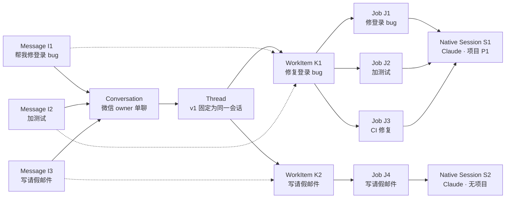
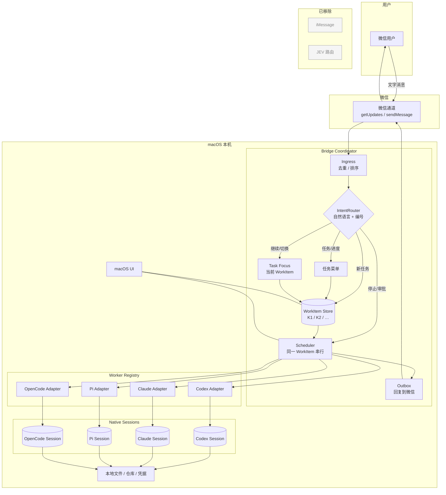
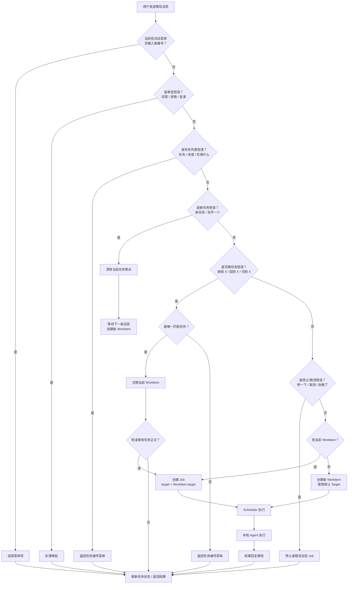

# 微信单通道 Super Agent 图

日期：2026-11-10。

## 1. 核心模型

```mermaid
flowchart LR
    I1["Message I1<br/>帮我修登录 bug"] --> C
    I2["Message I2<br/>加测试"] --> C
    I3["Message I3<br/>写请假邮件"] --> C

    C["Conversation<br/>微信 owner 单聊"] --> T["Thread<br/>v1 固定为同一会话"]

    T --> K1["WorkItem K1<br/>修复登录 bug"]
    T --> K2["WorkItem K2<br/>写请假邮件"]

    I1 -.-> K1
    I2 -.-> K1
    I3 -.-> K2

    K1 --> J1["Job J1<br/>修登录 bug"]
    K1 --> J2["Job J2<br/>加测试"]
    K1 --> J3["Job J3<br/>CI 修复"]
    K2 --> J4["Job J4<br/>写请假邮件"]

    J1 --> S1["Native Session S1<br/>Claude · 项目 P1"]
    J2 --> S1
    J3 --> S1
    J4 --> S2["Native Session S2<br/>Claude · 无项目"]
```

## 2. 系统架构

```mermaid
flowchart TB
    subgraph USER["用户"]
        U["微信用户"]
    end

    subgraph WX["微信"]
        WC["微信通道<br/>getUpdates / sendMessage"]
    end

    subgraph MAC["macOS 本机"]
        subgraph COORD["Bridge Coordinator"]
            IN["Ingress<br/>去重 / 排序"]
            IR{"IntentRouter<br/>自然语言 + 编号"}
            TM["任务菜单"]
            TF["Task Focus<br/>当前 WorkItem"]
            ST[("WorkItem Store<br/>K1 / K2 / …")]
            SCH["Scheduler<br/>同一 WorkItem 串行"]
            OB["Outbox<br/>回复到微信"]
        end

        subgraph WORKERS["Worker Registry"]
            CX["Codex Adapter"]
            CL["Claude Adapter"]
            PI["Pi Adapter"]
            OC["OpenCode Adapter"]
        end

        subgraph SESS["Native Sessions"]
            S1[("Codex Session")]
            S2[("Claude Session")]
            S3[("Pi Session")]
            S4[("OpenCode Session")]
        end

        FS["本地文件 / 仓库 / 凭据"]
        UI["macOS UI"]
    end

    subgraph REMOVED["已移除"]
        IM["iMessage"]
        JEV["JEV 路由"]
    end

    U -->|文字消息| WC
    WC --> IN
    IN --> IR
    IR -->|任务/进度| TM
    IR -->|新任务| ST
    IR -->|继续/切换| TF
    IR -->|停止/审批| SCH
    TM --> ST
    TF --> ST
    ST --> SCH
    SCH --> CX
    SCH --> CL
    SCH --> PI
    SCH --> OC
    CX --> S1
    CL --> S2
    PI --> S3
    OC --> S4
    S1 --> FS
    S2 --> FS
    S3 --> FS
    S4 --> FS
    SCH --> OB
    OB --> WC
    WC --> U
    UI --- ST
    UI --- SCH

    classDef removed fill:#f5f5f5,stroke:#999,color:#888;
    class IM,JEV removed;
```

## 3. 用户使用流程

```mermaid
flowchart TD
    A["用户发送微信消息"] --> B{"当前有活动菜单<br/>且输入是编号？"}
    B -->|是| B1["选择菜单项"]
    B -->|否| C{"是审批短语？<br/>同意 / 拒绝 / 批准"}
    C -->|是| C1["处理审批"]
    C -->|否| D{"是任务列表短语？<br/>任务 / 进度 / 在做什么"}
    D -->|是| D1["返回任务编号菜单"]
    D -->|否| E{"是新任务短语？<br/>新任务 / 另开一个"}
    E -->|是| E1["清除当前任务焦点"]
    E -->|否| F{"是切换任务短语？<br/>继续 X / 回到 X / 切到 X"}
    F -->|是| F1{"能唯一匹配任务？"}
    F1 -->|是| F2["切换当前 WorkItem"]
    F1 -->|否| F3["返回任务编号菜单"]
    F -->|否| G{"是停止/取消短语？<br/>停一下 / 取消 / 别做了"}
    G -->|是| G1["停止或取消当前 Job"]
    G -->|否| H{"有当前 WorkItem？"}
    H -->|是| H1["创建 Job<br/>target = WorkItem.target"]
    H -->|否| H2["创建新 WorkItem<br/>使用默认 Target"]
    H1 --> I["Scheduler 执行"]
    H2 --> I
    I --> J["本地 Agent 执行"]
    J --> K["结果回复微信"]
    K --> L["刷新任务状态 / 返回结果"]

    B1 --> L
    C1 --> L
    D1 --> L
    E1 --> M["等待下一条消息<br/>创建新 WorkItem"]
    F2 --> N{"短语里有任务正文？"}
    N -->|是| H1
    N -->|否| L
    F3 --> L
    G1 --> L
```
